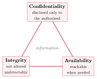

# Cloud computing and information security {#sec-01-cloud-information-security}

This chapter defines cloud computing, the three protection goals of
information security, and the relation between threat, risk and control.
Every later control (firewalls, TLS, access control, incident response) is
described in this vocabulary.

## Why cloud security {#sec-01-why-cloud-security}

Phones, watches, cars and most business applications are online around the
clock, and most of the services behind them run in the cloud. Industry
forecasts put the data created worldwide in 2025 at roughly 180 zettabytes.
More data and more services mean more exposure, and because most of these
services run in somebody's cloud, most of that exposure sits there too.

Security failures are usually read as technical failures: a bug, a breach, a
stolen password. The opening case has none of these and is still a security
failure.

::: {#exm-strava}
## The Strava heat map
In November 2017 the fitness platform Strava published an anonymised global
heat map of its users' running and cycling routes: billions of aggregated
activities without names. In most regions the map showed the expected pattern
of parks and river banks. In January 2018 an analyst observed that in certain
remote regions the only people wearing fitness trackers were soldiers, and their
daily runs traced the perimeters and internal paths of military bases whose
locations were classified.

No system was breached and no password was stolen. Every data point was
anonymous, and the publication was a deliberate decision. Three lessons follow, and each returns throughout the course. Aggregated
anonymous data can still reveal sensitive facts. The failure was a
governance decision rather than a technical one, because somebody chose what
to publish without reasoning about what could be inferred from it. And
confidentiality is contextual, since the same route is harmless in a city
park and sensitive at a military installation.
:::

The case shows that cloud security is first a way of reasoning about who can
see or change what, why, and what could go wrong. The reasoning connects a
threat to a control that fits the risk and justifies the connection.

Comer (2021) names six factors that make security harder in the cloud than in
a traditional infrastructure (Comer, 2021, pp. 233–234). The first is lack
of control and visibility: the tenant cannot examine or configure the
underlying systems and must trust the provider's configuration. The second is
an infrastructure shared with outsiders. The third is the large number of
services with dependencies among them, which enlarges the attack surface. The
fourth is a constantly changing set of running instances, whose sudden growth
is hard to tell apart from a denial-of-service attack. The fifth is remote
access for all users, and the sixth is heavy use of software from the
provider and from third parties. Each factor returns in a later session:
shared responsibility in this chapter, the dissolving perimeter in
Session 4, the moving target in Session 5, remote identity in Session 7 and
supply-chain risk in Session 8.

## Definition of cloud computing {#sec-01-definition-cloud-computing}

The cloud consists of physical machines in physical buildings, operated by
an organisation that is usually not the user. What sets them apart from
ordinary hosting is how their capacity is delivered: as a service, over a
network, on demand. The definition below follows NIST Special Publication
800-145, which the CSA Security Guidance also adopts (CSA, 2024,
pp. 12–14).

::: {#def-cloud}
## Cloud computing, after NIST SP 800-145
Cloud computing describes a model in which computing resources (networks,
servers, storage, applications and services) are drawn from a shared pool,
reached over a network, and set up and released on demand, quickly and with
little effort on the part of the customer or the provider.
:::

NIST names five essential characteristics, and a service that lacks one of
them is hosting or outsourcing rather than cloud computing. The first is
on-demand self-service: the customer provisions resources through a portal
or an API, with no human on the provider's side. The second is broad network
access: resources are reachable over standard networks from standard
clients. The third is resource pooling: the provider's hardware serves many
customers at once, so a virtual machine shares physical hardware with
strangers. The fourth is rapid elasticity: capacity grows and shrinks quickly
with demand. The fifth is measured service: usage is metered and paid for as
consumed. Of the five, resource pooling produces most of the security
questions in this course, because sharing hardware with strangers is exactly
what a traditional data centre never did.

::: {#exm-vm}
Two ways of obtaining a server illustrate the five characteristics. In the
classical way an organisation specifies hardware, obtains budget approval,
orders, waits for delivery, racks, cables and installs; the process takes weeks
to months. In the cloud way an administrator logs in to the provider's portal,
chooses a size and a region and creates the machine. It answers to
`ssh` within minutes and is metered by the hour. All five characteristics
appear in the second scene: self-service (nobody approved anything), broad
network access (the portal was reached from any location), resource pooling
(the capacity was already standing by, shared), elasticity (one machine can
become ten the same afternoon) and measured service (the bill covers exactly
those hours). Session 2 repeats this scene in the laboratory. The security
question of the whole course is contained in the same scene: the computer on
which the server appeared belongs to somebody else.
:::

The cloud is therefore somebody else's computer. This is not an argument
against the cloud; it is the reason why cloud security is a shared problem.
The provider owns the building, the power, the hardware and the
virtualisation layer, and the customer owns what runs on top.
@sec-01-service-models divides the layers between the two.

NIST also names four deployment models (CSA, 2024, pp. 15–16). A public
cloud is offered to everyone, and this course uses one. A private cloud is
operated for one organisation, a community cloud is shared by organisations
with common requirements, and a hybrid cloud combines these. The security
reasoning is the same in all four; only the allocation of responsibility
changes with who operates the pool.

## Security defined: the CIA triad {#sec-01-cia-triad}

The cloud does not change what is protected; it changes who controls each
layer on which protection is implemented. What is protected has three parts.

::: {#def-cia}
## The CIA triad
Information security describes the protection of three properties of
information and of the services that carry it. **Confidentiality**
means that information is disclosed only to authorised parties, typically
enforced by encryption and access control. **Integrity** means that
information is not altered without authorisation, or at least not without
detection, typically enforced by hashing, signing and logging.
**Availability** means that information and services are reachable
when needed, typically enforced by redundancy, resilience and protection
against denial of service.
:::

The triad structures the semester. Confidentiality is treated in Sessions 6
and 7 (encryption in transit, access control), integrity in Sessions 9
and 10 (monitoring, logging, the trustworthiness of the log record), and
availability in Session 3 (load and denial of service) and Session 11
(resilience, RAID and backup). For this reason the first question in any
scenario is which of the three properties is at stake.

{#fig-cia fig-alt="Diagram — a triangle with 'information' at its centre and one labelled box at each corner: Confidentiality (disclosed only to the authorised), Integrity (not altered undetectably) and Availability (reachable when needed)."}

::: {#exm-nextcloud-cia}
## One file, three properties
Throughout the course one concrete service is secured step by step: a
*Nextcloud* file-sharing platform that the laboratory builds up over the
semester, beginning with the Ubuntu machine beneath it, adding the service
itself in Session 5 and defending it until Session 13. Consider a single file
in it, `salary_list.pdf`. Confidentiality: only the finance staff may
open it, and an employee who reads it without permission has violated
confidentiality without touching anything else. Integrity: nobody may change
a figure inside it unnoticed, and if a change occurs the log must show who
made it and when. Availability: on the morning the payroll is run, the
server must answer, so an attacker who merely makes Nextcloud unreachable
has attacked the file without reading it.
Three attacks, three defences, one file.
:::

## Threat, risk and control {#sec-01-threat-risk-control}

In everyday language threat and risk are near-synonyms. In this course they
are distinct terms, because the difference between them decides which
control is appropriate.

::: {#def-trc}
## Threat, risk, control
A **threat** describes a potential cause of an incident: something that
could happen to the detriment of confidentiality, integrity or availability.
**Risk** describes the weight of a threat, expressed as likelihood
$\times$ impact. A **control** describes a measure that reduces a risk by
making the threat less likely, its impact smaller, or both.
:::

The three terms form a chain: name the threat, judge its likelihood and
impact, and only then choose a control in proportion to that judgement. Many
failures in practice break this order, either because controls are bought
before anyone has named the threat, or because threats are named without any
judgement of likelihood.

::: {#exm-ssh-trc}
## Continuation of @exm-vm
The virtual machine of @exm-vm answers on its SSH port to the whole
Internet. *Threat*: an attacker guesses or brute-forces the password of an
account and logs in. *Risk*: the likelihood is high, because automated
scanners find a fresh public SSH port within minutes, and the impact is high,
because a login means full control of the machine. *Control*: key-based
login only, and connections accepted only from the administrator's own address.
Session 4 implements this control with firewall rules, and Session 7
generalises it into the principle of least privilege. The analysis of any
incident follows the same structure: which CIA property was at stake, whose
responsibility it was, and which single control would have prevented the
incident.
:::

## Service models and shared responsibility {#sec-01-service-models}

Every application sits on a stack: networking, storage, servers,
virtualisation, operating system, middleware, runtime, and on top the
customer's data and application. How much of the stack is rented decides
which parts are the provider's problem and which remain the customer's.
Three service models cover the common cases (CSA, 2024, pp. 16–20).

::: {#def-servicemodels}
## Service models
**On-premises** describes the arrangement in which everything runs on the
organisation's own hardware, so that the organisation controls and secures the
whole stack. **IaaS** (Infrastructure as a Service) describes the
provision of fundamental compute, network and storage by the provider, with
the customer managing everything from the operating system upward.
**PaaS** (Platform as a Service) describes the additional provision of
development and application platforms such as databases and runtimes, with the
customer focusing on application and data. **SaaS** (Software as a
Service) describes the provision of a complete hosted application, with the
customer managing only configuration, identities and their own data.
:::

| **Layer** | **On-prem** | **IaaS** | **PaaS** | **SaaS** |
|:---|:---:|:---:|:---:|:---:|
| Application | C | C | C | P |
| Data | C | C | C | C |
| Runtime & middleware | C | C | P | P |
| Operating system | C | C | P | P |
| Virtualisation | C | P | P | P |
| Servers & storage | C | P | P | P |
| Networking | C | P | P | P |

: Responsibility by layer: C = customer, P = provider. From left to
right the customer manages fewer layers; the data row never leaves the
customer's column. {#tbl-sharedresp}

@tbl-sharedresp is the *shared-responsibility model* (CSA,
2024, pp. 21–23), and two rules follow from it. First, responsibility
follows control: whoever operates a layer secures it. In IaaS the provider
therefore guards the building, the hardware and the hypervisor, whereas an
unpatched operating system on the customer's virtual machine is the
customer's incident. Secondly, the data row stays with the customer in every
model. Even in SaaS, the customer decides who may access which data and what
published data reveals, which is exactly the decision that failed in
@exm-strava.

One further model appears in the learning outcomes. **SecaaS** (Security
as a Service) describes security capabilities themselves, for example
monitoring or identity services, consumed as a cloud service (CSA, 2024,
p. 19). In the cloud, in other words, even the defences can be rented.

::: {#exm-nextcloud-servicemodels}
## Continuation of @exm-nextcloud-cia
The running example makes the table concrete. If Nextcloud runs on an IaaS
virtual machine, as it does in the laboratory, the operating system, the web
server, TLS, the firewall and every update are the customer's responsibility;
the provider owes working hardware and isolation from the other tenants. If the
organisation subscribes to a hosted SaaS file-sharing product instead, almost
all of that moves to the provider. However, the decisions that would have
prevented the Strava case, namely who may see what and what is shared with
whom, remain with the customer. No service model therefore exists in which
security is entirely somebody else's problem.
:::

Resource pooling has one more consequence. Because a virtual machine shares
physical hardware with strangers, the isolation between virtual machines is
itself a security property: the provider delivers it and the customer must
be able to trust it. Session 5 treats this isolation under workload
security.

## Course design, literature and reading {#sec-01-course-design}

One service, the Nextcloud platform of @exm-nextcloud-cia, is the
red thread of the semester. Sessions 1 and 2 prepare the machine beneath it,
Session 3 installs Nginx, Session 5 installs the service with Docker, and
each later week adds one layer: firewall, TLS, identity, WAF, monitoring,
logging, backup. Session 13 then assembles the layers into one integrated
case. Every session follows the same sequence
of concept, threat, control, local laboratory, cloud transfer and
reflection, and a typical week pairs a two-hour lecture with a two-hour
laboratory in the students' own Ubuntu virtual machine. The laboratory of
this first week is light: check that the computer supports hardware
virtualisation, install VMware or VirtualBox, create an Ubuntu virtual
machine, and complete the Microsoft Learn module *Describe cloud
concepts*. Session 2 then covers Linux itself.

Nextcloud is a worked example, not a requirement: the method transfers to
any self-hosted web service, not the product.

Three books carry the course, each with its own role. The *CSA Security
Guidance v5* (CSA, 2024) provides the structure, since its twelve domains
organise the sessions. Jøsang (2024) provides the security backbone: CIA,
risk, cryptography, identity and access management, incident response and
governance. Comer (2021) provides the cloud fundamentals: virtual machines,
containers, Kubernetes and serverless computing. Tanenbaum and Bos (2015)
supply the operating-systems foundations of Sessions 2 and 7. A short
Microsoft Learn module accompanies each session, so Azure is the companion
environment rather than a textbook.

Each session builds on terms the reading introduced, so the reading is best
done before the session. The SQ3R method fits the chapters:
survey the headings and figures, formulate the questions the chapter should
answer, read with those questions in mind, recite the answers in one's own
words, and review after a few days.

**Reading for this chapter.** CSA Security Guidance, Domain 1
(Cloud Computing Concepts & Architectures, pp. 10–27); Comer, Chapters 1–3
(pp. 5–32) and §17.2 (Cloud-Specific Security Problems, pp. 233–234);
Jøsang, Chapter 1 (Basic Concepts of Cybersecurity, pp. 1–24). The Microsoft Learn module for Session 1
is linked on Canvas.

## Summary {#sec-01-summary}

Cloud computing is a delivery model: on-demand network access to a pooled,
elastic, metered set of computing resources (@def-cloud),
rented as IaaS, PaaS or SaaS (@def-servicemodels). Security
protects confidentiality, integrity and availability
(@def-cia) by one chain of reasoning: name the threat, weigh
the risk, then choose a control that fits the risk
(@def-trc). What the cloud changes is the division of
labour: responsibility follows control of each layer, no layer is unowned,
and the data, together with the judgement about what it reveals, stays with
the customer (@exm-strava). Session 2 turns to the infrastructure
beneath the model: the Linux server, its baseline and the virtualised data
centre.

## Exercises {#sec-01-exercises}

::: {#exr-01-five-characteristics}
## Five essential characteristics
Name the five essential characteristics of cloud computing and, for each, one
sentence on where it appears in @exm-vm.
:::

::: {#exr-01-strava-cia}
## Strava case, in CIA terms
In the Strava case (@exm-strava): which CIA property was harmed,
and why is the claim that the data was anonymised not a sufficient defence?
:::

::: {#exr-01-trc-vulnerability}
## Threat, risk, control for a vulnerability
A team runs Nextcloud on an IaaS virtual machine. A critical vulnerability is
published for the Linux distribution on that machine. Whose task is the patch,
and which definition of this chapter answers the question?
:::

::: {#exr-01-open-ssh-port}
## Open SSH port as threat–risk–control
Formulate the open SSH port of @exm-ssh-trc strictly in the
vocabulary of @def-trc: one sentence each for threat, risk and
control.
:::

::: {#exr-01-saas-reduces-risk}
## When SaaS reduces the risk
Give one realistic scenario in which moving from IaaS to SaaS reduces the
security workload, and one responsibility that the move does not remove.
:::

::: {#exr-01-cia-triangle}
## The CIA triad, interactive
Three of the six terms below are the protection goals of @def-cia; the other
three are distractors. Drag each protection goal onto the corner of the
triangle whose description matches it (or click a term, then click a corner),
then press **Check**.


:::

## Self-check {#sec-01-self-check}

**Q1** *(tests @sec-01-definition-cloud-computing · basic)*
Which of the five essential characteristics of cloud computing produces most
of the security questions in this course, because it means sharing hardware
with strangers?

a. On-demand self-service
b. Broad network access
c. Resource pooling
d. Measured service

**Q2** *(tests @sec-01-cia-triad · basic)*
On the morning the payroll is run, an attacker makes the Nextcloud server
unreachable without reading or changing any file on it. Which statement is
correct?

a. No CIA property was harmed, because no data was read or altered
b. Confidentiality was harmed, because the payroll file was exposed
c. Integrity was harmed, because the service no longer behaves as intended
d. Availability was harmed, because the service was not reachable when needed

**Q3** *(tests @sec-01-threat-risk-control · basic)*
In one or two sentences: how does this chapter define *risk*, and how does it
relate a risk to a threat?

**Q4** *(tests @sec-01-service-models · basic)*
According to the shared-responsibility model (@tbl-sharedresp), which layer
remains the customer's responsibility in every service model, including SaaS?

a. Virtualisation
b. Data
c. Networking
d. Operating system

**Q5** *(tests @sec-01-why-cloud-security · basic)*
Name two of the six factors Comer gives for why security is harder in the
cloud than in a traditional infrastructure.

**Q6** *(tests @sec-01-why-cloud-security · basic)*
In the Strava heat-map case, what kind of failure does the chapter say
occurred?

a. A technical failure: a system was breached by attackers
b. A credential failure: user passwords were stolen and abused
c. A governance failure: a publication decision was made without reasoning about what could be inferred
d. A cryptographic failure: the published data was too weakly encrypted

**Q7 — applied scenario** *(tests @sec-01-service-models · applied)*
Building on @exr-01-saas-reduces-risk: a small firm currently runs Nextcloud
on an IaaS virtual machine and is offered a hosted SaaS file-sharing product
instead. Management claims the move would make security "entirely the
provider's problem". Using the shared-responsibility model, name two security
tasks that would genuinely move to the provider, one responsibility that
stays with the firm in either model, and explain — with reference to the
Strava case — why management's claim is wrong.
