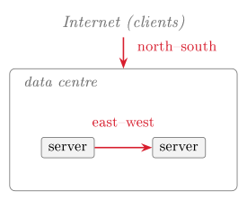

# Data centres, virtualisation and Linux {#sec-02-data-centres-virtualisation-linux}

This chapter covers the infrastructure beneath the cloud: data centres,
virtualisation and the Linux server. Every later control attaches to one of
these layers, so they are treated first. The laboratory records the baseline
of the students' own virtual machine.

## The cloud as a distributed system {#sec-02-distributed-system}

The cloud is a *distributed system*: many computers in many buildings,
cooperating over a network and presented to the customer as one service.
Four properties follow from this. The first is scale: a large provider
operates thousands to millions of servers that no human knows individually.
The second is sharing: many customers, called *tenants*, use the same
physical hardware, which is the resource pooling of
@def-cloud under the name *multi-tenancy*. The third is
failure as the normal case: at this scale some component is always broken,
so the system is built to keep working regardless, and Session 11 applies
the same attitude to the students' own designs. The fourth is abstraction:
the customer rents capability without knowing which machine serves it.

Because a tenant shares hardware with strangers and cannot point at its own
server, trust boundaries are logical rather than physical. They consist of
layers, identities and policies instead of a locked door.

## Inside the data centre {#sec-02-inside-data-centre}

The data centre is a building engineered for density, power, cooling and
resilience (Comer, 2021, pp. 37–42). Servers sit in *racks*, a
top-of-rack switch connects the servers of each rack, and racks form
*pods* for which power and cooling are engineered as a unit. Around the
equipment sit redundant power with batteries and diesel generators,
industrial cooling, physical access control and continuous monitoring.

Cooling consumes a large share of the energy, so the layout serves cooling:
hot-aisle/cold-aisle containment places racks so that intake and exhaust air
never mix. Because everything is managed remotely, modern data centres are
lights-out buildings in which almost nobody works. Both facts bear on
security, since physical access control and power-and-cooling redundancy are
the foundation of availability (@def-cia). In
@tbl-sharedresp they are provider rows, and accepting those rows
as P means trusting this building.

## Traffic and geography {#sec-02-traffic-geography}

Traffic in a data centre has two directions (Comer, 2021, p. 44).
*North–south* traffic runs between the data centre and the outside
world, that is, clients calling services. *East–west* traffic runs
between servers inside the data centre: services calling services,
replication, remote storage access. In the cloud, east–west traffic
dominates, and this changes the network design. A tree-shaped network forces
east–west traffic up the tree and back down, so the links near the root
carry the combined load of everything beneath them, and because network
hardware comes in fixed capacities, the root link cannot always be made fast
enough (Comer, 2021, p. 45). The *leaf–spine* design removes the
bottleneck (Comer, 2021, pp. 45–49): every leaf (top-of-rack) switch
connects to every spine switch, so any server reaches any other over an
equal-cost path. Where a single cable would not suffice, *link
aggregation* bonds several physical links into one logical link, and a super
spine extends the design further.

The same flat, any-to-any network that makes services fast also lets an
intruder move sideways once inside, and because most cloud traffic is
internal, that movement is invisible from outside. This *lateral
movement*, an attacker moving from one internal system to the next, and the
segmentation that limits it are the subject of Session 4.

{#fig-nsew fig-alt="Diagram — a data-centre box containing two servers: a 'north–south' arrow connects the Internet (clients) to the data centre, and an 'east–west' arrow connects the two servers inside it."}

Providers also replicate capacity across the globe, so that a single failure
or disaster does not take a customer down.

::: {#def-regions}
## Region, availability zone, region pair
A **region** describes a geographic area containing one or more data
centres (for example *Norway East*). An **availability zone**
describes a physically separate data centre, or group of data centres, within
a region, with independent power, cooling and network. A **region pair**
describes two regions linked for replication and disaster recovery.
:::

Zones bound the blast radius of a failure: a power problem in one zone leaves
the others standing, so a deployment spread across zones survives it.
Session 11 builds on this vocabulary.

Above the physical geography sits an administrative one. Azure organises
resources in a hierarchy: management groups apply policy and access across
many subscriptions; a subscription is a billing and isolation boundary; a
resource group is a lifecycle container for related resources; and the
resources themselves (a VM, a disk, a network) sit at the bottom.
Governance, billing and access control all attach to this tree.

A small number of very large providers, which Comer (2021) calls
*hyperscalers*, run data centres of this kind at global scale and rent
their capacity to everyone else (Comer, 2021, pp. 31–32). The three largest
are Amazon Web Services, Microsoft Azure and Google Cloud, and their
dominance has two consequences. The first is *provider lock-in*: each
provider's services and interfaces differ, so moving between them is costly.
Large organisations therefore sometimes run *multi-cloud*, more than
one provider on purpose, at the price of learning and securing two systems
(Comer, 2021, pp. 28–31). The second is that the shared-responsibility
model takes a different concrete form on each provider, so a control known
on one platform, such as a security group's default, may behave differently
on another. The concepts transfer; the buttons do not. Microsoft Azure is
the worked environment of this course, and the reasoning built there
carries to the others.

## Virtualisation and the hypervisor {#sec-02-virtualisation}

Virtualisation is what makes this infrastructure rentable.

::: {#def-hypervisor}
## Virtualisation, hypervisor
Virtualisation describes the technique by which one physical machine runs many
isolated *virtual machines* (VMs), each behaving as if it owned the
hardware. The **hypervisor** describes the software layer that mediates
between them. A **Type 1** (bare-metal) hypervisor runs directly on the
hardware (ESXi, Xen, Hyper-V) and is what data centres and clouds use. A
**Type 2** (hosted) hypervisor runs as an application on a host operating
system (VMware Workstation, VirtualBox) and is what the laboratory uses on the
students' laptops.
:::

Every rented cloud VM is a guest on a Type 1 hypervisor the customer never
sees, and the Ubuntu machine in the laboratory is a guest on a Type 2
hypervisor the student installed. The mechanics are the same: the hypervisor
gives each guest *virtual hardware*, namely a vCPU that is a share of
real cores, a memory slice, a virtual disk that is a file on real storage,
and a virtual network card attached to a virtual switch.

Isolation between guests rests on processor privilege levels (Comer, 2021,
pp. 59–60). Normally the kernel runs privileged and applications run
unprivileged. With virtualisation the hypervisor takes the most privileged
level and each guest kernel moves one step down. The guest kernel behaves as
if it controlled the hardware, but every privileged operation passes through
the hypervisor, which also presents the emulated or para-virtualised
devices. This layering is what keeps one VM from touching another.

Comer (2021) sorts the technologies into three approaches (Comer, 2021,
pp. 55–57). Software emulation interprets every guest instruction in
software; it is general but slow, and useful mainly when the guest was built
for a different processor. Para-virtualisation modifies the guest operating
system so that it cooperates with the hypervisor. Full virtualisation, the
cloud default, runs the guest unmodified: almost all instructions execute
directly on the real processor, and only privileged operations trap into the
hypervisor. This is why the server of @exm-vm appears in two
minutes: creating a VM starts a program rather than assembling hardware.

## The Popek–Goldberg criterion {#sec-02-popek-goldberg}

A hypervisor must meet three requirements at once: *safety*, full
control of the virtualised resources; *fidelity*, so that a program
behaves on the virtual machine exactly as on bare hardware; and
*efficiency*, so that most guest code runs without the hypervisor's
intervention (Tanenbaum & Bos, 2015, p. 474). An interpreter that simulated
every instruction would be safe and faithful but slow. Real hypervisors
therefore let most instructions run directly on the processor, which raises
the question of how the dangerous ones are caught.

Popek and Goldberg (1974) answered it (Tanenbaum & Bos, 2015,
pp. 474–476). Every processor with a kernel mode and a user mode has
*sensitive* instructions, which behave differently in the two modes
(for example I/O or changes to the memory-management unit), and
*privileged* instructions, which trap to the kernel when attempted in
user mode. A machine is cleanly virtualisable only if the sensitive
instructions are a subset of the privileged ones, because then every
instruction that could reveal or disturb the real machine's state traps when
a demoted guest attempts it, and the hypervisor can emulate the result.
Trap-and-emulate, the mechanism behind full virtualisation, depends on this
guarantee.

The x86 processor did not meet the criterion. Intel's 386 had sensitive
instructions that were not privileged: `POPF` silently failed to
change the interrupt-enable flag in user mode instead of trapping, and a
program could read its code-segment selector to discover that it was in user
mode. A guest kernel could therefore notice or misbehave without any trap,
and for two decades the x86 could not host a hypervisor directly (Tanenbaum
& Bos, 2015, p. 475). Two solutions followed. VMware (from 1999) used
*binary translation*: as the guest ran, its kernel code was rewritten
on the fly, the unsafe instructions replaced by safe sequences that trapped
into the hypervisor, while ordinary user code ran untouched. In 2005 Intel VT
and AMD-V then added a processor mode in which trap-and-emulate works
directly, controlled by a hypervisor-set bitmap of which operations trap.
Modern cloud virtualisation runs on those extensions.

Two terms complete the picture (Tanenbaum & Bos, 2015, p. 477). A Type-1
hypervisor runs directly on the hardware with no host operating system
beneath it, which is why cloud providers run this kind. A Type-2 hypervisor
runs as an application inside a host operating system, which is what VMware
Workstation and VirtualBox are on a laptop. Para-virtualisation avoids the
trapping problem altogether by not pretending to be bare hardware: the
guest is modified to call the hypervisor through *hypercalls*,
explicit requests comparable to a program's system calls, and trades an
unmodified guest for speed and simplicity.

Virtualisation thus works by forcing the guest's most dangerous actions to
trap into a more privileged layer. A *VM escape* breaches that wall:
code breaks out of its guest into the hypervisor, and every guest above it
is exposed. Weak isolation shows first as the *noisy neighbour*, a
tenant whose load degrades another's, and in the worst case as VM escape.
The hypervisor is therefore the trust boundary between strangers sharing
hardware, and Session 5 treats that boundary as something to be defended.

::: {#exm-migration}
## Continuation of @exm-vm
Because a VM's hardware is virtual, its entire state (memory, disk, devices)
is data; Comer (2021) calls the VM a *digital object* (Comer, 2021,
pp. 63–64). The virtual machine of @exm-vm can therefore be saved
as a file, a *snapshot*, usable as backup, clone or roll-back point. It can
also move while running: in *live migration* the hypervisor pre-copies the
guest's memory to another physical host, pauses the guest briefly, finalises
the transfer, and the machine continues elsewhere with almost no downtime
(Comer, 2021, pp. 64–65). Providers use this constantly to balance load and to
service hardware without taking customers offline.

The security implication follows from the VM being a computer reduced to data: a
VM-as-file can be copied or stolen as a whole, and a snapshot may capture
secrets that were only ever meant to exist in memory. Data security
(Sessions 6 and 10) inherits this problem.
:::

VMs are not the only packaging. A *container* virtualises the operating
system rather than the hardware: it shares the host's kernel, weighs
megabytes instead of gigabytes and starts in seconds, at the price of weaker
isolation (Comer, 2021, pp. 71–72). A VM is a whole computer in software,
whereas a container is a packaged process, and the two therefore differ in
threat model. Session 5 covers containers.

## Linux, the shell and the four pillars {#sec-02-linux-four-pillars}

Almost all cloud infrastructure runs on Linux, a UNIX-like kernel first
released by Linus Torvalds in 1991, for four practical reasons. It is open
source, so there is no per-server licence at scale and the code can be
inspected and modified. It is stable and modular, running for years with
only the components installed that are needed. It is scriptable, since
everything is reachable from the command line, which is what makes
automation possible. And it is everywhere, from supercomputers to phones and
routers. Every laboratory from here on therefore runs in the students'
Ubuntu VM; Ubuntu is the *distribution* used here, the kernel plus a
chosen set of tools.

Linux, macOS and Windows share the parts that security reasoning rests on
(Tanenbaum & Bos, 2015, Chapters 10 and 11). All three enforce the
kernel/user split of @sec-02-virtualisation, give every process
its own virtual address space, schedule processes pre-emptively and route
all hardware access through system calls. Their kernels differ in structure:
Linux has a *monolithic* kernel, one large privileged program that
loads modules; Windows uses a layered *hybrid* NT kernel; macOS runs
XNU, a hybrid of the Mach microkernel and a BSD UNIX layer. Because the
shared part dominates, the protection-domain model of Session 7 applies to
all three. Two differences matter in practice. Linux and macOS are UNIX-like
and POSIX-compatible, so their shells, permissions and tools are close,
whereas Windows has its own APIs. And the public cloud runs mainly on Linux
servers, which are free to run at scale and are the platform almost all
cloud software targets, whereas Windows Server holds an enterprise niche and
macOS is a desktop system. This course works in Linux because the servers to
be defended run it.

A server has no graphical desktop, so work runs through a *shell*,
usually `bash`. Four commands suffice for orientation: `pwd`
(current directory), `ls -l` (list files with permissions),
`cd` (change directory) and `cat` or `less` (read a
file). The filesystem is one tree, and the Filesystem Hierarchy Standard
fixes where things live: configuration under `/etc`, log files under
`/var/log`, user files under `/home`, programs under
`/bin` and `/usr`. Session 7 covers users and permissions.

Linux is multi-user, and one account is special: `root`, which the
kernel does not refuse. Working permanently as root means that any slip, or
any attacker who hijacks the session, acts with unlimited impact. The
convention is therefore to work as an ordinary user and to raise single
commands with `sudo`, which asks for a password and leaves a trace;
this is least privilege (Session 7) in tool form. Software is installed and
updated through the package manager: `sudo apt update` refreshes the
catalogue and `sudo apt upgrade` applies pending updates. On an IaaS
machine this patching is the customer's job, and an unpatched service is
among the most common ways real systems are compromised.

The chapter ends on the command line because of a principle that carries
the second half of the course: before something abnormal can be recognised,
normal must be known. A baseline of CPU, memory, disk and network is
therefore the starting point of all detection.

| **Resource** | **Command** | **Output** |
|:---|:---|:---|
| CPU | `lscpu` | model, cores, virtualisation flags |
| CPU / load | `top` / `htop` / `btop` | live processes, CPU %, load average |
| Memory | `free -h` | used and free RAM and swap |
| Disk | `df -h` | free space per filesystem |
| Disk | `du -sh` *dir* | size of a directory |
| Network | `ss -tulpn` | listening sockets and open ports |
| Logs | `journalctl` | system and service log entries |

: The observation commands used in every laboratory of the semester. {#tbl-baseline}

The table has four pillars (CPU, memory, disk, network) plus logs.
`top` and its successors show live load, and the *load average*
compares demand to the number of cores. `free -h` shows whether the
system is swapping, a sign of memory pressure. A full disk takes services
down, so `df` and `du` matter more than they appear to.
`ss -tulpn` lists every port the machine listens on, and each of them
is a door an attacker may try, which Session 4 turns into policy.
`journalctl`, lastly, is the primary log source for Session 10.

::: {#exm-spike}
Three observations show why a baseline is a security tool and not only an
administrator's habit. A sudden CPU spike at 03:00 may be crypto-mining, a
runaway process or an attack. A disk filling unusually fast may be logs
flooding, or data being staged for exfiltration. An unexpected listening
port is a service nobody started. None of these observations answers
anything by itself, but each of them, compared against a known baseline,
shows where the threat–risk–control questions of @def-trc
should be asked.
Without the baseline the deviation would not be noticed. In Sessions 9 and 10
exactly these signals feed an intrusion detection system and the incident
timeline; monitoring is the same set of metrics observed continuously.
:::

## Laboratory: recording the baseline {#sec-02-laboratory}

Exercise 2 has three steps. First, boot the Ubuntu VM prepared after
Session 1, open a terminal and inspect the system with `lscpu`,
`free -h`, `df -h`, `ss -tulpn` and
`journalctl -xe`. Secondly, install `htop` and `btop`
with `sudo apt install` and compare them with plain `top`.
Thirdly, record the output, label it and keep it, because this recording is
the reference against which every later week measures change.

**Reading for this chapter.** Comer, Chapter 4 (Data Center
Infrastructure and Equipment, pp. 37–51) and Chapter 5 (Virtual Machines,
pp. 55–68), the primary reading this week; CSA Security Guidance, Domain 7,
Section 7.1 (Cloud Infrastructure Security, pp. 147–153). For the theory of
virtualisation in depth: Tanenbaum and Bos, *Modern Operating Systems*,
§7.2 (Requirements for Virtualization, the Popek–Goldberg criterion,
pp. 474–476) and §7.3 (Type 1 and Type 2 Hypervisors, p. 477); for the
operating-system families, Chapter 10 (UNIX, Linux and Android) and
Chapter 11 (Windows). On providers and lock-in: Comer, Chapter 3 (Types of
Clouds, including hyperscalers and multi-cloud, pp. 25–32). Optional
deepening: Jøsang, Chapter 3 (System Security, incl. virtualisation in §3.6, pp. 43–62). The Microsoft Learn module
is *Describe Azure architecture and services*; students map regions,
zones, subscriptions and resource groups onto the portal.

## Summary {#sec-02-summary}

The cloud is a distributed system: many shared machines in engineered
buildings, where failure is normal and trust boundaries are logical. Scale is
organised in racks and pods, in regions, availability zones and region pairs
(@def-regions), and in a management hierarchy. A hypervisor
(@def-hypervisor) gives each guest virtual hardware and
passes every privileged operation through itself; the Popek–Goldberg
criterion states when that works, and Intel VT and AMD-V made it work on
x86. Isolation between strangers' workloads is therefore a security
property. Because a machine is data, snapshots and live migration are
possible, and so are their risks (@exm-migration). Linux runs the
cloud, the shell is the interface, and the four pillars of
@tbl-baseline, measured while the system is healthy, are the
baseline for every later anomaly. Session 3 places a real service on the
machine and pushes it until it strains.

## Exercises {#sec-02-exercises}

::: {#exr-02-north-south-east-west}
## North–south vs east–west traffic
Explain north–south versus east–west traffic, state which dominates in the
cloud, and name the network design that answers it.
:::

::: {#exr-02-hypervisor-types}
## Type 1 vs Type 2 hypervisors
Define both hypervisor types, give one example of each, and state where each
appears in the course setup.
:::

::: {#exr-02-isolation-security}
## Isolation as a security property
Why is isolation between virtual machines a security property and not merely a
performance concern? Name the mild and the worst-case failure of it.
:::

::: {#exr-02-which-command}
## Which command for which question
Which command answers each question: Which ports is this machine listening on?
How much memory is free? What has the `ssh` service logged?
:::

::: {#exr-02-blast-radius}
## Blast radius of one zone
A deployment runs in one availability zone of one region. Which failures in
@def-regions does it survive, and what should be changed
first?
:::

::: {#exr-02-hypervisor-sort}
## Type 1 or Type 2, interactive
Sort the seven items below into the two hypervisor types of
@def-hypervisor: drag each item into the matching box, or click an item and
then click a box (click a placed item to send it back). Then press
**Check**.


:::

::: {#exr-02-baseline-commands}
## The baseline commands, interactive
Building on @exr-02-which-command: match the observation commands of
@tbl-baseline to the question each one answers. Drag a command onto a
question, or click a command and then click a question (click a placed
command to send it back); two of the seven commands answer none of these
questions. Then press **Check**.


:::

## Self-check {#sec-02-self-check}

**Q1** *(tests @sec-02-traffic-geography · basic)*
Why does a leaf–spine network design replace a tree-shaped network in cloud
data centres?

a. It encrypts north–south traffic before it leaves the building
b. It removes the root-link bottleneck by giving any two servers an equal-cost path, which suits the dominant east–west traffic
c. It reduces cooling costs by separating intake and exhaust air
d. It physically separates each tenant's servers into their own rack

**Q2** *(tests @sec-02-popek-goldberg · basic)*
According to the Popek–Goldberg criterion, a machine is cleanly virtualisable
only if:

a. every sensitive instruction is a subset of the privileged instructions, so that it traps when a demoted guest attempts it
b. every instruction is interpreted in software by the hypervisor
c. the guest operating system is modified to call the hypervisor through hypercalls
d. the processor has more than two privilege levels available

**Q3** *(tests @sec-02-virtualisation · basic)*
Which virtualisation approach is the cloud default, running the guest
unmodified with almost all instructions executing directly on the real
processor and only privileged operations trapping into the hypervisor?

a. Software emulation
b. Para-virtualisation
c. Full virtualisation
d. Containerisation

**Q4** *(tests @sec-02-linux-four-pillars · basic)*
Name the four pillars of the baseline that the observation commands measure,
and the fifth source that complements them.

**Q5** *(tests @sec-02-popek-goldberg · basic)*
In one or two sentences: what is a *VM escape*, and why is it the worst-case
failure of isolation?

**Q6** *(tests @sec-02-distributed-system · basic)*
In the chapter's vocabulary, what does *multi-tenancy* mean?

a. One customer runs many virtual machines in many regions
b. Many customers use the same physical hardware, the resource pooling of the cloud definition under another name
c. A provider operates data centres in more than one country
d. An organisation deliberately uses more than one cloud provider

**Q7 — applied scenario** *(tests @sec-02-linux-four-pillars · applied)*
Building on @exr-02-which-command: during a morning check of the laboratory
VM you notice that the disk is filling unusually fast and that the machine is
listening on a port that was not in your recorded baseline. For each of the
two observations, name the command that revealed it, state why the recorded
baseline is what makes the observation meaningful, and formulate — in the
vocabulary of the threat–risk–control chain — the question you would ask
next for each.
