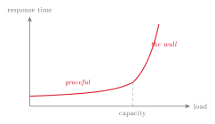
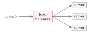

# Web services, load and denial of service {#sec-03-web-services-load-dos}

This chapter places a web server on the measured machine of Chapter 2,
loads it until it strains, and reads the strain with the baseline tools. The
subject is availability. Because a denial-of-service attack is demand
engineered to exceed capacity, understanding load is the start of the
defence.

## Web services and capacity {#sec-03-web-services-capacity}

::: {#def-webserver}
## Web server
A **web server** describes a program that listens on a network port,
accepts HTTP *requests* and returns *responses* (pages, data or
files). A request carries a method (`GET`, `POST`, …), a
path and headers. A response carries a status code (`200` OK,
`404` not found, `503` service unavailable, …), headers and
a body.
:::

The web server of this course is *Nginx*: fast, widely deployed, usable
as a reverse proxy and, from Session 8, as the host of the web application
firewall. The laboratory installs it this week. The distance between a
`200` and a `503` response is what load measurement makes
visible.

A single machine answers many users through *concurrency*, that is, by
handling many connections at the same time, and three facts set the limit.
Each client occupies a connection while it is served, and the number of
connections is finite. The server runs several *workers*, each handling
many connections. Every request costs CPU, memory and I/O. When requests
therefore arrive faster than the server completes them, the queue grows,
latency rises and requests are dropped. That ceiling is *capacity*.

::: {#def-capacity}
## Capacity and availability
**Capacity** describes the amount of work a system can do per unit time
(for a web server: requests per second), bounded by CPU, memory, connections
and bandwidth, and established by measurement rather than estimation.
**Availability**, one of the three CIA properties, describes the service
being reachable and responsive when needed. Availability is lost when demand
exceeds capacity, whether by accident or by attack.
:::

Because a denial-of-service attack is demand engineered to exceed capacity,
the next section covers measurement before it covers attackers.

## Measuring load {#sec-03-measuring-load}

Capacity is established by pushing the service until it strains, on one's
own machine. The tool is `ab` (ApacheBench), which sends many requests
at a chosen concurrency:

```
ab -n 1000 -c 50 http://localhost/
```

This sends one thousand requests, fifty at a time, and reports requests per
second, time per request and the share of requests that failed. While
`ab` runs, `htop` or `btop` in a second terminal shows
CPU and memory climbing, and Nginx writes every request to the access log at
`/var/log/nginx/access.log`. These are the tools of
@tbl-baseline, now pointed at a service under pressure.

::: {#exm-thewall}
## Continuation of @exm-spike
At low concurrency, latency barely moves: the service degrades
*gracefully*. As concurrency rises, queues build and time per request
climbs. Beyond a certain point the curve bends sharply upward, timeouts
appear, `503` responses replace `200` responses, and the service
is effectively down. Plotting response time against concurrent requests yields
a flat region followed by a steep rise, which this script calls the wall. Two
observations follow. First, the wall is a property of a specific service on a
specific machine. It can be measured in an afternoon, and it is preferable to
know it before someone else finds it. Secondly, the shape is the same whether
the load comes from real customers or from an attacker. The metrics cannot
show why demand exceeded capacity; they show only that it did. Distinguishing
stress from attack requires the logs and the methods of later sessions.
:::

{#fig-wall fig-alt="Diagram - a graph of response time against load: the curve stays nearly flat in a region labelled 'graceful', then bends sharply upward past a dashed vertical line labelled 'capacity', into a region labelled 'the wall'."}

## Scaling out: load balancing and elasticity {#sec-03-scaling-out}

A single server has a hard ceiling, and the cloud grew out of one early
answer to it. Popular web sites of the early Internet exceeded the capacity
of one machine, so a *cluster* of identical servers was placed behind a
*load balancer* that spreads requests across them (Comer, 2021,
pp. 8–9). Scaling *out* with many commodity machines proved cheaper and
more resilient than scaling *up* to one ever-larger machine, and shared
buildings made the model affordable (Comer, 2021, pp. 10–11). Load
balancing is therefore one of the ideas the cloud is built on.

{#fig-loadbalancer fig-alt="Diagram - clients connect to a load balancer, which fans out to three identical servers."}

A load balancer provides three things at once. It provides capacity, since
more servers share the work. It provides resilience, since one server can
fail and the balancer stops sending it traffic. And it enables
*autoscaling*, since interchangeable instances let the platform add
servers when load rises and remove them when it falls. This third property
is the rapid elasticity of @def-cloud: the customer pays for
the peak only while the peak lasts, and the provider re-sells the idle
capacity.

Comer (2021) calls this *elastic computing* and traces it to
virtualisation (Comer, 2021, pp. 16–18). Because a virtual server is
created and destroyed by software in moments, the provider can follow each
tenant's demand and pack many tenants' fluctuating loads onto the same
physical machines, since their peaks rarely coincide. The customer changes
scale without owning hardware for the maximum, and the provider keeps its
machines busy. The same rapid appearance and disappearance of instances,
however, turns the attack surface into a moving target, which Session 5
takes up.

Azure offers the corresponding services, and this week's Microsoft Learn
module covers them. A *Virtual Network* (VNet) is the customer's
private network in the cloud, and its segmentation limits the blast radius
of an incident. The *Azure Load Balancer* distributes traffic within a
region at Layer 4 (IP address and port), whereas the *Application
Gateway* balances at Layer 7 and hosts the WAF of Session 8. *Traffic
Manager* and *Front Door* balance globally across regions, DNS- and
edge-based, and therefore also absorb volumetric attacks close to their
source. The laboratory builds the idea locally with one Nginx.

Because instances appear and disappear with demand, a fixed list of servers
cannot be secured; only a *pattern* can. Session 5 turns this into
hardening the image rather than the machine, and Session 12 into automation.

## The minimum viable network {#sec-03-minimum-viable-network}

A real service is a set of *tiers*: a web tier that speaks HTTP to the
world, an application tier for business logic, and a database tier for
durable data, with the load balancer in front. Nextcloud follows this
pattern on a small scale: web server, PHP application code and a database,
which from Session 5 all sit on the students' single VM.

The CSA Security Guidance calls the secured form of this arrangement the
*minimum viable network* (MVN) (CSA, 2024, pp. 154–155). An MVN
contains no more network than the application needs, so each tier accepts
connections only from the tier directly above it, and only on the ports that
tier uses. The Internet reaches only the load balancer, on HTTPS; the web
tier answers only the balancer; the application tier only the web tier; the
database only the application tier; and everything not explicitly permitted
is dropped. An attacker who wants the database therefore has no path to it
except through the application. Two ideas carry forward from this:
*default-deny*, which Session 4 turns into firewall rules, and
layering, which Session 4 calls defence in depth. In both, the legitimate
flows are listed and the rest is forbidden; attackers are never listed.

## Availability as a number: the SLA {#sec-03-sla}

Providers commit to availability by contract.

::: {#def-sla}
## Service-level agreement
A **service-level agreement** (SLA) describes the level of service a
provider commits to, typically as a percentage of uptime over a period.
:::

Two design rules follow. First, deploying across availability zones (or
availability sets) removes single points of failure and thereby raises the
promised uptime. Secondly, chaining several services multiplies their
availabilities, so a solution built from many components has a lower
combined SLA than any single component. More components therefore mean less
availability unless redundancy is added on purpose.

::: {#exm-compositesla}
A service chains three components: a load balancer at 99.99 %, a virtual
machine at 99.9 % and a database at 99.95 %. Every request needs all three,
so the combined availability is the product:
$$
  0.9999 \times 0.999 \times 0.9995 \approx 0.9984 \;=\; 99.84\,\%.
$$
The result appears close to the inputs until it is translated into hours:
0.16 % of a year is about fourteen hours of expected downtime, against
roughly one hour for the load balancer alone. Every chained component spends
availability, and only deliberate redundancy buys it back. Availability is
therefore an architectural property that can be quantified and designed for. Session 11 develops this thread.
:::

## Denial of service {#sec-03-denial-of-service}

::: {#def-ddos}
## DoS and DDoS
A **denial-of-service** (DoS) attack describes an attempt to make a
service unavailable to legitimate users by exhausting a resource (bandwidth,
connections, CPU or memory). A **distributed** denial-of-service attack
(DDoS) describes the case in which the load comes from thousands of
compromised machines at once, a *botnet*, which makes the traffic hard to
distinguish from real users and hard to block by source.
:::

DoS attacks availability directly, and DDoS attacks come in three types,
ordered by how far up the stack they strike. *Volumetric* attacks
saturate the network link, for example with UDP floods and amplification,
and are measured in gigabits or terabits per second. *Protocol* attacks
exhaust connection state in servers or firewalls, the classic case being the
SYN flood, and are measured in packets per second. *Application-layer*
attacks send cheap-looking but expensive requests that exhaust the
application itself, for example a flood against a search endpoint, and are
hard to tell apart from real users. The higher up the stack the attack
strikes, the smaller it needs to be and the more it resembles legitimate
traffic, and the Nginx access log is where that difference shows.

::: {#exm-ddos-trc}
## Continuation of @exm-ssh-trc
The vocabulary of @def-trc applies to the new threat.
*Threat*: an application-layer flood against the service's most expensive
endpoint. *Risk*: the likelihood is moderate to high, because such floods
need no large botnet and little skill, and the impact is high, because
@exm-thewall showed how quickly a single machine reaches the wall.
*Control*: not one but several layers, the subject of the next section.
In one sentence: availability was at stake, on an IaaS machine the defence
is the customer's responsibility, and the single most effective first
control is a rate limit.
:::

## Defending availability in layers {#sec-03-defending-in-layers}

Defence against engineered load is layered, and the layers split by who
operates them. On the customer's own server, *rate limiting* caps requests per
client, in Nginx through the `limit_req` directive, and thereby
blunts application-layer floods. *Timeouts and connection limits* stop
slow or stuck clients from hoarding state. *Caching* serves repeated
content cheaply and so raises the effective capacity of the expensive
paths. At cloud scale, *autoscaling* adds capacity under
load, *CDNs and anycast* absorb volume close to its source, *cloud
DDoS protection* scrubs traffic upstream, and the *WAF* filters
malicious requests at Layer 7 (Session 8). The attack types and the defences
pair up: volume is absorbed at the edge, protocol floods are the platform's
business, and the application layer is where the customer's own
configuration (rate limits, caching, well-designed endpoints) carries the
weight. Rate limiting is therefore the first hands-on control of the
semester: small, local and effective.

## Laboratory: Apache2 and Nginx under load {#sec-03-laboratory}

Exercise 3 installs a web server, loads it and reads the evidence. The
packages are installed with `sudo apt install nginx apache2-utils`,
and the welcome page is checked in a browser. Two names appear here.
`apache2` (the Apache HTTP Server) and `nginx` are the two
dominant web servers, and they answer the concurrency problem of
@def-capacity differently. Apache traditionally dedicates a
process or thread per connection, which is simple but heavier under many
connections. Nginx uses an event-driven model that handles thousands of
connections in a few processes. The course serves with Nginx and uses
Apache as the second server in the load-balancing exercise. The load-testing
tool `ab` ships with Apache's utilities, which is why
`apache2-utils` is installed even to test Nginx. The procedure has
four steps. Open `htop` or `btop` in one terminal. Run
`ab -n 2000 -c 100 http://localhost/` in another and watch CPU climb
while `ab` reports its requests-per-second figure. Tail
`/var/log/nginx/access.log` and match the spike in the log with the
spike in `htop`, the same event seen by two tools. Optionally add a
`limit_req` rule, repeat the run, and compare the failed-request
count. All output is saved and labelled.

A load-testing tool and a denial-of-service tool are the same program; the
difference is authorisation. Pointed at `localhost`, `ab` is
measurement and homework. Pointed at a machine one neither owns nor has
written permission to test, the same command is an attack, a criminal
offence in Norway as in essentially every jurisdiction, and a disciplinary
matter at the university, regardless of intent or outcome. In this
laboratory, everything attacked belongs to the attacker.

**Reading for this chapter.** Comer, §1.5 (From Clusters to Web
Sites and Load Balancing, pp. 8–9), Chapter 2 (Elastic Computing and Its
Advantages, pp. 15–22) and Chapter 14, §§14.2–14.7 (client–server,
scaling, and stateless servers, pp. 195–200); CSA Security Guidance,
Domain 7, Section 7.2 (Cloud Network Fundamentals, including the minimum
viable network, pp. 153–162). Optional deepening: Jøsang, Chapter 2 (Attack
Vectors and Malware, pp. 25–42, on DoS/DDoS). The Microsoft Learn module is
*Describe Azure compute and networking services*; students map the
session's ideas onto Load Balancer, Application Gateway and Azure DDoS
Protection.

## Summary {#sec-03-summary}

A web server answers HTTP requests with finite capacity, because
concurrency, workers and a cost per request set a ceiling
(@def-webserver and @def-capacity). Load is measured
with `ab`, `htop` and the access log, and every service has a
wall (@exm-thewall). Availability fails when demand exceeds
capacity, and a DDoS attack engineers exactly that, in volumetric, protocol
or application-layer form (@def-ddos). The defence is
therefore layered: rate limiting, timeouts and caching on the customer's
server; autoscaling, CDNs, scrubbing and the WAF in the cloud. Availability
can also be counted: SLAs promise it, zones raise it, and chained components
multiply it down (@exm-compositesla). Session 4 decides which
traffic may reach the service at all.

## Exercises {#sec-03-exercises}

::: {#exr-03-load-security-bridge}
## The load–security bridge
State the bridge sentence connecting load to security, and explain why
capacity must be measured rather than estimated.
:::

::: {#exr-03-apachebench-command}
## Reading an ApacheBench command
Explain the command `ab -n 2000 -c 100 http://localhost/`: what
exactly happens, and which three numbers in its report matter most?
:::

::: {#exr-03-three-ddos-types}
## The three DDoS types
Name the three DDoS types, one example each, and state which is hardest to
distinguish from legitimate traffic, and why.
:::

::: {#exr-03-composite-sla}
## Computing a composite SLA
A solution chains two services at 99.95 % and one at 99.5 %. Compute the
combined availability and the expected yearly downtime (1 year
$\approx$ 8760 h).
:::

::: {#exr-03-application-layer-flood}
## An application-layer flood
An attacker floods a search endpoint with plausible-looking queries. Which
defence layer carries the weight, which concrete Nginx directive implements
it, and why would a CDN alone not suffice?
:::

::: {#exr-03-ddos-sort}
## The three DDoS types, interactive
Classify the six attack characteristics below into the three DDoS types of
@def-ddos: drag each item into the matching box, or click an item and then
click a box (click a placed item to send it back). Then press **Check**.


:::

::: {#exr-03-mvn-order}
## The minimum viable network, interactive
Arrange the four tiers of @sec-03-minimum-viable-network into the order in
which a request from the Internet passes them, remembering that each tier
accepts connections only from the tier directly above it. Drag a tier to a
new position, or click its ▲/▼ buttons to move it. Then press **Check**.


:::

::: {#exr-03-sla-numeric}
## A composite SLA, computed
Compute the composite availability of the chained service below, as in
@exm-compositesla: multiply the three availabilities, then translate the
missing share of the year into hours. Enter both numbers and press
**Check**.


:::

::: {#exr-03-defence-pairs}
## The layered defence, matched
Match each defence layer of @sec-03-defending-in-layers to what it does
against engineered load: click a layer and then its description (or drag
the layer onto it). A correct pair locks and greys out; a wrong attempt
flashes red. Then press **Check**.


:::

::: {#exr-03-load-truefalse}
## Measuring load, true or false
Judge each statement about measuring load, the wall (@exm-thewall,
@fig-wall) and the laboratory rules of @sec-03-laboratory: click **True**
or **False** on every row, then press **Check**.


:::

## Self-check {#sec-03-self-check}

**Q1** *(tests @sec-03-web-services-capacity · basic)*
How does this chapter say a web server's capacity should be established?

a. By estimation from the hardware specifications
b. By measurement: pushing the service until it strains
c. By reading the provider's SLA for the machine
d. By counting the number of worker processes

**Q2** *(tests @sec-03-denial-of-service · basic)*
A SYN flood, measured in packets per second, exhausts connection state in
servers or firewalls. Which DDoS type is this?

a. Volumetric
b. Protocol
c. Application-layer
d. Amplification

**Q3** *(tests @sec-03-scaling-out · basic)*
Which statement about scaling matches the chapter?

a. Scaling up to one ever-larger machine proved cheaper and more resilient than scaling out
b. Scaling out places a cluster of identical commodity servers behind a load balancer, and proved cheaper and more resilient than scaling up
c. A load balancer adds capacity but removes resilience, because it is a single point of failure
d. Autoscaling requires servers that are individually configured and therefore not interchangeable

**Q4** *(tests @sec-03-sla · basic)*
In one or two sentences: why does a solution built from many chained
components have a lower combined SLA than any single component?

**Q5** *(tests @sec-03-minimum-viable-network · basic)*
In one or two sentences: in a minimum viable network, which connections may
each tier accept, and what happens to everything not explicitly permitted?

**Q6** *(tests @sec-03-laboratory · basic)*
Why does the laboratory install `apache2-utils` even though the service
being tested is Nginx?

a. Nginx cannot serve a welcome page without Apache installed
b. Apache is required as a reverse proxy in front of Nginx
c. The load-testing tool `ab` ships with Apache's utilities
d. The access log format is defined by the Apache project

**Q7 - applied scenario** *(tests @sec-03-defending-in-layers · applied)*
Building on @exr-03-application-layer-flood: your Nextcloud VM's search
endpoint, whose wall you have measured with `ab`, starts receiving a steady
stream of plausible-looking queries and response times climb towards the
wall. Describe the layered response you would take on the customer's side of
the split: name two concrete server-side controls from this chapter (one of
them the Nginx directive), explain what each does against this specific
attack type, and state which evidence - from the load-measurement tools -
you would use to verify that the controls worked.
