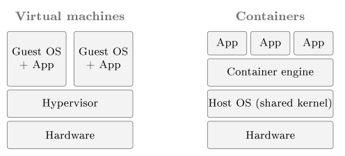

# Cloud-native versus lift-and-shift {#sec-05-cloud-native-lift-and-shift}

This chapter installs Nextcloud as a container on the hardened VM. The
choice of a container raises the central question of the week: an
application can be carried into the cloud unchanged, or it can be rebuilt
the way the cloud works, and the difference is a security difference. The
chapter therefore covers the two migration paths, containers, the kernel
beneath them, and the immutable workload model.

## Two ways into the cloud {#sec-05-two-ways-into-the-cloud}

Comer (2021) separates *conventional* software, written for a fixed
machine that an administrator tends, from *cloud-native* software,
written to run as many interchangeable instances that the cloud creates and
destroys as needed (Comer, 2021, p. 146). The CSA Security Guidance turns
the same distinction into migration strategies (CSA, 2024, pp. 152–153).

::: {#def-migration}
## Lift-and-shift and cloud-native
**Lift-and-shift** (rehosting) describes moving an application to the
cloud with as little change as possible: the same server, operating system and
management, now on a rented VM instead of an owned one. **Cloud-native**
(re-architecting or rebuilding) describes redesigning the application to use
the cloud's own patterns (interchangeable instances, containers, managed
services, automated scaling) so that it can be created, replaced and scaled
by software.
:::

The Guidance names three strategies on this spectrum (CSA, 2024,
pp. 152–153). Rehosting is lift-and-shift with the least change.
Refactoring adjusts the application to use some cloud services.
Re-architecting or rebuilding is fully cloud-native: the most change and the
most benefit, the highest cost in time and people, and the only path on
which security can be designed in from the start. Lift-and-shift is fast and
low-risk to perform, because nothing changes and therefore nothing breaks.
Cloud-native is slow and demanding, because it needs new skills, new tools
and rewriting. The rest of this chapter gives the security reason for
resisting the faster path where possible.

## Containers {#sec-05-containers}

::: {#def-container}
## Container
A **container** describes a package of an application together with its
libraries and dependencies in a single image that runs as an isolated process
on a host, sharing the host's operating-system kernel rather than carrying its
own. It is lightweight (megabytes rather than gigabytes), starts in seconds
and runs identically wherever the container runtime runs.
:::

A virtual machine virtualises the hardware, so a whole guest operating
system runs on emulated devices. A container instead virtualises the
operating system: the host kernel uses isolation features (Linux
*namespaces*) to give each container its own view of processes, files
and network, while all containers share one kernel (Comer, 2021,
pp. 73–77). The dominant technology is Docker. A plain-text
*Dockerfile* names a base image, the software to add and the command to
run; a build step turns the recipe into an image; and the image runs as a
container anywhere (Comer, 2021, pp. 81–83). The same image therefore runs
the same way on a laptop, in the laboratory and in the data centre, which
is what lets the cloud treat instances as interchangeable.

Because a container shares the host kernel, the wall between two containers
is thinner than the wall between two virtual machines. A VM is a whole
computer in software, whereas a container is a packaged process.
Cloud-native systems use containers because packaged processes are cheap to
start, stop and replicate, and VMs remain the stronger isolation boundary
beneath them.

{#fig-vmcontainer fig-alt="Diagram - two stacks side by side: the VM stack layers Hardware, Hypervisor, and two boxes each holding a Guest OS plus App; the container stack layers Hardware, Host OS (shared kernel), Container engine, and three App boxes on top."}

## The kernel {#sec-05-the-kernel}

The *kernel* is the single program that runs in the processor's
privileged mode (@sec-02-virtualisation). It owns the hardware,
schedules every process, manages memory and is the only gateway through
which a program reaches a resource; a program asks by making a *system
call*, which traps into the kernel. Everything else (the shell, Nginx,
Nextcloud) is *user space*, and the set of system calls is the contract
every program on that system is compiled against.

That contract differs between the three operating-system families. Linux
runs a *monolithic* kernel: scheduler, memory manager, filesystems,
network stack and drivers form one privileged program in one address space,
extended at run time by loadable modules. The Linux kernel also provides the
two mechanisms containers are built from. *Namespaces* give a process
an isolated view of one class of resource, such as its own process list,
network interfaces, filesystem root or user IDs (Comer, 2021, p. 74), and
*control groups* (cgroups) cap how much CPU, memory and I/O it may
consume. A container is therefore an ordinary Linux process wrapped in a set
of namespaces and a cgroup; there is no machine inside it.

Windows runs the *NT* kernel, a *hybrid* design whose kernel-mode
Executive sits above a small core, and its system calls and its ideas of
processes, objects and security are its own. Windows containers accordingly
use Windows kernel features and run Windows images. macOS runs *XNU*, a
hybrid of the *Mach* microkernel and a *BSD* (UNIX) layer with a
driver framework on top. It presents a UNIX/POSIX interface, which is why
its shell resembles Linux's, but its kernel has no built-in idea of Linux
containers.

{#fig-kernels fig-alt="Diagram - three columns for Linux, Windows and macOS, each stacked as user space (apps, containers), a dashed system-call boundary, the kernel, and hardware; the Linux kernel is one undivided monolithic block (scheduler, memory, filesystems, network, drivers - one space), while Windows NT and macOS XNU are hybrid, each layering an outer part (Executive + subsystems; BSD (Unix) layer) over a small core (microkernel core; Mach microkernel)."}

A Linux container therefore needs a Linux kernel, because the image holds
libraries and binaries but no kernel. `docker run` on a Windows or
macOS laptop consequently does not run Linux containers on Windows or
Darwin. Docker Desktop instead runs a small Linux virtual machine in the
background, on Windows through WSL 2 and on macOS through the platform's
virtualisation framework, and the containers run on that Linux kernel.
Containers sit on top of virtualisation; they do not replace it (Comer,
2021, pp. 71–75).

The security point follows. The wall around a virtual machine is the
hypervisor's hardware-enforced boundary, whereas the wall around a
container is the kernel itself, enforcing namespace separation between
processes on one kernel. A flaw in the shared kernel is therefore shared by
every container on the host, and a *container escape*, code breaking
out of its namespaces into the host kernel, endangers every other container
and the host at once, whereas a VM escape must first defeat the hypervisor.
For this reason the host kernel belongs to each container's trust boundary
and must be kept patched, and a workload that needs a hard boundary still
gets its own VM.

## Why containers, and orchestration {#sec-05-why-containers-orchestration}

A virtual machine carries a whole guest operating system, which takes
minutes to boot and gigabytes of memory (Comer, 2021, p. 72). That is
acceptable for a long-running server but too heavy when a service must add
and drop instances by the second to follow demand, and a container starts
within that second and costs megabytes. The need to scale on demand is
therefore the reason why containers rather than VMs became the unit of
cloud-native deployment; the thinner wall is the price.

A service made of many short-lived containers on many machines needs
something that decides where each one runs, restarts the ones that die and
scales their number. That task is *orchestration*, and Comer (2021)
covers the dominant system, Kubernetes (Comer, 2021, pp. 127–140).
Kubernetes groups containers into *pods*, schedules them onto worker
nodes and runs a *control plane* that continuously drives the running
system toward a declared desired state. Students do not operate Kubernetes,
but two of its ideas return. Its control plane is a management plane and
therefore a prime target (Session 7), and its continuous comparison of
reality with a declared state is the control-loop thinking behind
monitoring (Session 9) and declared infrastructure (Session 8).

## Ephemeral versus immutable workloads {#sec-05-ephemeral-immutable}

The CSA Security Guidance describes two ways of treating a workload over its
life, and here the architectural choice becomes a security choice (CSA,
2024, pp. 179–180).

::: {#def-immutable}
## Ephemeral and immutable workloads
A workload is **ephemeral** (short-running) when its instances are
treated as disposable: created from a fixed image to do their work and then
discarded. It is **immutable** when a running instance is never modified
in place, so that to change or fix it a new image is built and the instance
replaced rather than patched. The opposite, mutable long-running model keeps
instances alive for long periods and maintains them by hand.
:::

One note on terms is necessary. The heading of the relevant Guidance section
attaches the label immutable to the long-running model, whereas the text
beneath it describes immutable infrastructure as the replace-rather-than-
patch practice of the short-running model (CSA, 2024, p. 179). This script
follows the text, which matches industry usage.

Cloud-native architectures run mostly ephemeral, immutable workloads:
security is built into the image, and a compromised or outdated instance is
replaced rather than repaired. Lift-and-shift, in contrast, produces
long-running instances carried over from the on-premises world, maintained
by hand and patched in place. The Guidance regards short-running workloads
as the safer model for three reasons (CSA, 2024, p. 180). An instance that
lives for minutes gives an attacker little time. Every instance is built by
automation from the same tested image, so no two drift apart. And one image
can be tested once, whereas a long-running server must be assessed again and
again. Immutable infrastructure thus prevents the slow accumulation of
unpatched, drifted, slightly different servers.

This changes a lesson of Session 2. Patching an IaaS machine with
`apt` remains correct for a lift-and-shift VM. In the cloud-native
world, however, the running instance is not patched at all; the image is
rebuilt with the fix and fresh instances are rolled out. Both approaches are
legitimate, and recognising which world applies tells the administrator
which move is correct.

::: {#exm-patch-two-worlds}
## One vulnerability, two worlds
A critical vulnerability is published for a library Nextcloud uses. In the
lift-and-shift world, with Nextcloud on a long-running VM, the control is the
one from Chapter 1: patch promptly, in place, on that machine, with the
residual risk of a second copy elsewhere. In the cloud-native world, with
Nextcloud as a container built from an image, the control is to update the
image, rebuild, and replace every running container with the new version,
retiring the vulnerable ones entirely. The threat and the CIA properties at
stake (integrity and confidentiality of the files) are the same. The controls
differ because the two worlds treat a running instance differently: one as an
asset to be maintained, the other as a part to be swapped.
:::

## Securing workloads in a moving environment {#sec-05-securing-moving-workloads}

When instances appear and vanish with demand, security practices inherited
from static data centres stop fitting, and the Guidance names the
adjustments (CSA, 2024, pp. 180–181). Monitoring agents must be small, must
understand the cloud, and must not depend on a fixed IP address or any other
setting that stays the same, because in an autoscaling group addresses and
names are handed out and taken back all the time. For the same reason a new
instance registers itself with the monitoring system when it starts, and
its log entries carry the identity of the workload rather than only an
address. Vulnerability scanning over the network, the traditional method,
often no longer works either, because internal networks are closed by
default and each workload's security group admits only the connections it
needs, so a scanner on the same subnet may be unable to reach its targets.
The Guidance therefore offers three alternatives: check each VM or container
image at build time, before it is deployed, so that only images known to be
good ever run; assess snapshots of running VMs offline; or build assessment
agents into the images. The first is the shift-left approach that Session 8
develops into DevSecOps.

The thinner wall has its own controls. Because containers share a kernel, a
flaw in the kernel or the runtime can let code escape one container into the
host or a neighbour, the container version of the VM escape of Session 2.
The Guidance therefore recommends minimal images, so that a container holds
less to exploit; least-privilege configuration, including not running
containers as root; and a patched runtime.

## The red thread: Nextcloud arrives {#sec-05-red-thread-nextcloud}

Exercise 5 runs Nextcloud as a Docker container on the prepared VM: one
command pulls the image, one runs it, and the file-sharing platform is live
behind the firewall of Session 4. Nextcloud-in-a-container is an image that
can be rebuilt and replaced, so it is the immutable pattern at laboratory
scale. The service still answers plain, unencrypted HTTP, however, so every
file and password crosses the network unencrypted, and Session 6 closes
that gap with TLS.

**Reading for this chapter.** Comer, Chapter 5 (Virtual Machines,
pp. 55–68), Chapter 6 (Containers: §6.3 elasticity on demand, namespaces,
Docker and Dockerfiles, pp. 71–83), Chapter 10 (Orchestration and Kubernetes,
pp. 127–140) and §11.3 (Cloud-Native vs. Conventional Software, p. 146);
CSA Security Guidance, Domain 8, Section 8.1 (Cloud Workload Security: short-
and long-running workloads, impact on traditional controls, SCA and SBOM,
pp. 177–182) and Domain 7, §7.1.5 (Cloud Migration Architecture: rehost,
refactor, re-architect, pp. 152–153). Optional deepening: Jøsang,
Chapter 11 (Secure by Design, pp. 243–270). The Microsoft Learn module is *Describe
Azure compute* (containers and container instances).

## Summary {#sec-05-summary}

Lift-and-shift rehosts an application unchanged, whereas cloud-native
rebuilds it around the cloud's own patterns (@def-migration),
with refactoring in between. The container (@def-container)
is a process sharing the host kernel, reproducible and cheap to replicate,
but with thinner isolation than a VM, because the shared kernel is part of
every container's trust boundary. Cloud-native workloads are ephemeral and
immutable (@def-immutable): security is built into a tested
image and instances are replaced rather than patched, which limits exposure,
enforces consistency and eases verification, whereas lift-and-shift inherits
the long-running, hand-patched model. The same vulnerability therefore meets
different controls in the two worlds (@exm-patch-two-worlds), and
workload security in a moving environment means cloud-aware agents,
assessment of images before deployment and defence of the container wall.
Nextcloud is now running as a container on plain HTTP, and Session 6
encrypts the transport.

## Exercises {#sec-05-exercises}

::: {#exr-05-lift-vs-cloud-native}
## Lift-and-shift vs cloud-native
Explain the difference between a lift-and-shift migration and a cloud-native
application, and place refactoring on the spectrum between them.
:::

::: {#exr-05-container-vm-isolation}
## Container vs VM isolation
A container and a virtual machine both isolate workloads. What does each
virtualise, and which gives the stronger isolation boundary? Name one security
consequence of the difference.
:::

::: {#exr-05-immutable-safer}
## Why immutable workloads are safer
Why does the CSA Guidance consider short-running, immutable workloads more
secure than long-running ones? Give the three reasons.
:::

::: {#exr-05-vulnerable-dependency}
## A vulnerable dependency
A library used by the service has a critical vulnerability. Describe the
control in the lift-and-shift world and the control in the cloud-native world,
and state why they differ.
:::

::: {#exr-05-network-scanning-fails}
## Why network scanning fails
Why does network-based vulnerability scanning largely fail against
cloud-native workloads, and what does the Guidance recommend instead?
:::

::: {#exr-05-vm-or-container}
## VM or container, interactive
Each of the eight cards below describes either a virtual machine or a
container (@def-container, @fig-vmcontainer). Drag each card into the box it
describes, or click a card and then click a box; click a placed card to send
it back. Then press **Check**.


:::

::: {#exr-05-which-world}
## Lift-and-shift or cloud-native, interactive
Sort the six statements into the world they belong to: lift-and-shift or
cloud-native (@def-migration, @def-immutable). Drag a card into a box, or
click the card and then the box (click a placed card to send it back), then
press **Check**.


:::

::: {#exr-05-kernel-terms}
## The kernel and its mechanisms, interactive
Match each term from @sec-05-the-kernel to its description: click a term and
then its partner (or drag one onto the other). A correct pair locks and greys
out; a wrong attempt flashes red. Then press **Check**.


:::

::: {#exr-05-three-kernels}
## Three kernels, one shape, interactive
Fill in the properties of the three kernels of @fig-kernels: click a cell to
mark that the property holds for that kernel, click again to clear it. A row
is right only when exactly its true cells are filled. Then press **Check**.


:::

::: {#exr-05-moving-workloads}
## Security in a moving environment, true or false, interactive
Judge each statement about securing workloads in a moving environment
(@sec-05-securing-moving-workloads): click **True** or **False** for each
(click again to clear), then press **Check**.


:::

::: {#exr-05-orchestration}
## Orchestration in three answers, interactive
Answer the three short questions on orchestration
(@sec-05-why-containers-orchestration) by typing into the boxes; spelling is
checked generously and capitalisation does not matter. Then press **Check**.


:::

## Self-check {#sec-05-self-check}

**Q1** *(tests @sec-05-two-ways-into-the-cloud · basic)*
The CSA Guidance names three migration strategies. Which of the following
describes *refactoring*?

a. Moving the application unchanged onto a rented VM, with the least change
b. Adjusting the application to use some cloud services, without a full rebuild
c. Redesigning the application entirely around the cloud's own patterns
d. Keeping the application on-premises and renting only storage from the cloud

**Q2** *(tests @sec-05-containers · basic)*
What does a container virtualise?

a. The hardware, so that a whole guest operating system runs on emulated devices
b. The operating system, giving each container its own view of processes, files and network while all share one kernel
c. The hypervisor, so that several hypervisors can run on one machine
d. Only the network, so that each container gets its own IP address but shares all other resources openly

**Q3** *(tests @sec-05-the-kernel · basic)*
In one or two sentences: why can a Linux container not run directly on a
Windows or macOS kernel, and how does Docker Desktop run Linux containers on
those laptops anyway?

**Q4** *(tests @sec-05-the-kernel · basic)*
Which two Linux kernel mechanisms is a container built from?

a. A hypervisor and emulated devices
b. VLANs and VXLAN
c. Namespaces and control groups (cgroups)
d. System calls and loadable kernel modules

**Q5** *(tests @sec-05-ephemeral-immutable · basic)*
In one or two sentences: what does it mean for a workload to be *immutable*,
and what is the correct response to a compromised or outdated instance in
that model?

**Q6** *(tests @sec-05-why-containers-orchestration · basic)*
Why did containers rather than VMs become the unit of cloud-native
deployment?

a. Containers give a stronger isolation boundary than virtual machines
b. A container starts within a second and costs megabytes, so a service can add and drop instances fast enough to follow demand
c. Virtual machines cannot run Linux workloads in the cloud
d. Containers remove the need for an orchestration system such as Kubernetes

**Q7 - applied scenario** *(tests @sec-05-ephemeral-immutable · applied)*
Building on @exr-05-vulnerable-dependency: your Nextcloud runs as a Docker
container built from an image, and a critical vulnerability is published for
a library inside that image. A teammate proposes logging into the running
container and patching the library in place, "since that is what we did on
the VM in Session 2". Explain which world this deployment belongs to, what
the correct control is instead, and use the Guidance's three reasons for the
short-running model to justify why the correct control leaves the service
more secure than the teammate's proposal.
