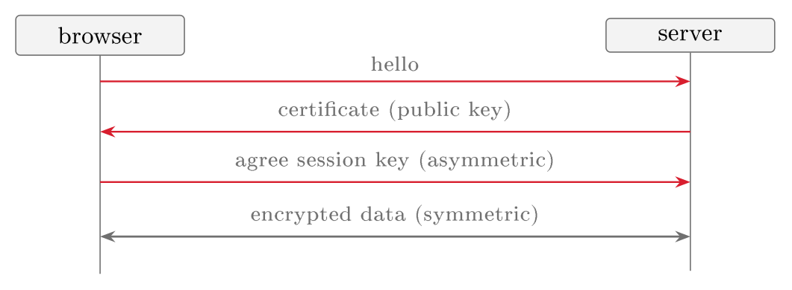

# TLS and data in transit {#sec-06-tls-data-in-transit}

Since Session 5, Nextcloud serves every file and every password over plain
HTTP, readable by anyone on the network path. This chapter closes that gap.
It covers the three states of data, the two families of cryptography, and
TLS, which combines them to protect a connection. The laboratory turns
`http://` into `https://`.

## Three states of data {#sec-06-three-data-states}

Data is always in one of three states, and each is exposed differently, so
each needs its own control (CSA, 2024, pp. 210–211).

::: {#def-datastates}
## The three data states
**Data at rest** describes data held in storage: on a virtual disk, in
object storage, in a database. **Data in motion** (in transit) describes
data being transmitted between locations, across a network or the Internet.
**Data in use** describes data currently being processed in memory by an
application. Each state requires its own security measures, and protecting one
does not protect the others.
:::

The three states map onto the course. Data at rest is the subject of
Session 11 (backup and storage), where disk and object encryption guard
against a stolen drive or an exposed bucket. Data in use is guarded mainly by
the access controls of Session 7, because the program working on the data
must be able to read it, which makes this the hardest state to protect. This
session covers the middle state, data in motion, because it is the one the
running Nextcloud currently ignores. The Guidance's advice for data in
motion is encryption protocols and secure channels that protect
confidentiality and integrity in transit (CSA, 2024, p. 211), and TLS is that
channel.

## Two families of cryptography {#sec-06-two-crypto-families}

Encryption turns readable *plaintext* into unreadable *ciphertext*
under the control of a *key*, reversibly for whoever holds the right key
and not otherwise. Tokenisation is a different mechanism: it replaces a
sensitive value with an unrelated random token and keeps the mapping in a
secure store. There are two families of encryption, and TLS needs both
(Jøsang, 2024, pp. 65–80).

::: {#def-crypto}
## Symmetric and asymmetric encryption
**Symmetric** encryption describes the case in which one shared secret
key both encrypts and decrypts. It is fast and suits bulk data, but both
parties must already share the key. **Asymmetric** (public-key)
encryption describes the case in which each party has a *key pair*, a
public key that may be shared freely and a private key kept secret, such that
what one key locks only the other unlocks. It solves the key-sharing problem
and enables digital signatures, but is far slower than symmetric encryption.
:::

The two families have complementary strengths. Symmetric encryption is fast
but cannot deliver the shared key to the other party over an untrusted
network without the key being observed. Asymmetric encryption can protect
that exchange, because the public key may travel in the open, but it is too
slow for a whole video call or file transfer. TLS therefore uses asymmetric
encryption once, at the start, to agree on a fresh symmetric key, and then
uses that key for the data: slow handshake, fast conversation.

One question remains, and it turns cryptography into a system. A browser
that receives a public key claiming to belong to a Nextcloud server needs a
reason to believe that the key is the server's and not an impostor's
(Jøsang, 2024, pp. 105–112).

::: {#def-pki}
## Certificate and PKI
A **digital certificate** describes a binding of a public key to an
identity (a domain name), signed by a **certificate authority** (CA) that
both parties trust. The **public-key infrastructure** (PKI) describes the
system of authorities, certificates and trust relationships that makes this
work at Internet scale. A browser trusts a server's public key because a CA it
already trusts has confirmed, by its signature, that the key belongs to that
domain.
:::

Without this binding, encryption alone would be worth little, because a
client could hold a perfectly private conversation with an attacker who had
placed themselves in between and supplied their own public key. The
certificate lets the browser check that it is talking to the right server
before it trusts the channel, so authentication here works for
confidentiality.

## TLS {#sec-06-tls}

::: {#def-tls}
## TLS
**Transport Layer Security** (TLS) describes the protocol that secures
data in motion for most Internet traffic. In a short *handshake* the
parties authenticate the server through its certificate, use asymmetric
cryptography to agree on a symmetric session key, and then encrypt the rest
of the connection with it. HTTP carried inside TLS is **HTTPS**, the
padlock in the browser.
:::

The handshake is the two families of @def-crypto working
together: the certificate (PKI) proves who the server is, asymmetric
encryption establishes a shared secret, and symmetric encryption then
protects the bulk traffic. TLS thereby delivers three properties for data in
motion: confidentiality, since eavesdroppers see only ciphertext; integrity,
since tampering in transit is detected; and server authentication, since the
client is talking to the certified server.

{#fig-tls fig-alt="Diagram — a sequence diagram between a browser and a server: the browser sends 'hello', the server returns 'certificate (public key)', the parties 'agree session key (asymmetric)', and a final double-headed arrow shows 'encrypted data (symmetric)' flowing both ways."}

Four practical points carry into the laboratory. First,
versions matter: TLS 1.2 is the minimum and TLS 1.3 the current version,
whereas TLS 1.0 and 1.1 survive only for backward compatibility and are
disabled, because a downgrade to a broken version undoes the protection.
Secondly, certificates must be obtained and kept valid, because an expired
certificate breaks the service as surely as a misconfiguration. Thirdly, in
the cloud the private keys behind certificates belong in a managed key store
(Azure Key Vault, AWS KMS) rather than in a file beside the application, and
the Guidance advises a customer of IaaS or PaaS to begin with the key
management service the provider offers (CSA, 2024, p. 229). Lastly, TLS
protects data in motion between endpoints and does nothing for the same data
once it sits decrypted on the server (at rest) or is processed there (in
use); encrypting the channel is necessary, not sufficient.

Encryption also has a cost for the defenders of Session 4: a firewall or
NGFW performing deep packet inspection sees only ciphertext inside a TLS
connection. Enterprises sometimes resolve this with *TLS inspection*
(TLS termination, break-and-inspect), decrypting traffic at a gateway,
examining it and re-encrypting it onward. This restores inspection but
breaks end-to-end confidentiality at one trusted point, with the
concentration risk that implies. A control that serves one property can thus
hinder another, and the engineer decides the trade-off rather than ignoring
it.

::: {#exm-tls-trc}
## http becomes https
The file of Chapter 1, `salary_list.pdf`, is now served by the
Nextcloud deployed in Session 5. *Threat*: an attacker on the network
path (shared Wi-Fi, a compromised router) reads the file and the login
password as they cross in plain HTTP. *Risk*: on any untrusted network
the likelihood is real and the impact high, because it covers the
confidentiality of the file and of credentials that unlock far more.
*Control*: serve the site over HTTPS, so that the certificate
authenticates the server and TLS encrypts the transport; the interceptor now
sees only ciphertext. This defends the confidentiality property of
@exm-nextcloud-cia in transit. The control does not cover the
same file at rest on the server, nor the question of who is allowed to open
it at all. Those are Sessions 11 and 7.
:::

## Beyond the browser: VPNs and data on the move {#sec-06-vpns-data-on-move}

TLS protects one connection between a browser and a server, but in the
cloud remote access is the default: employees reach the service over the
Internet, often from their own devices, at home or in public places. Comer
(2021) gives three principles for this situation (Comer, 2021,
pp. 240–241). The first is to keep all communication confidential. On a
Wi-Fi network an outsider can capture every packet. The answer is a
*virtual private network* (VPN), which forms an encrypted connection to
the organisation's cloud data centre and routes all of a device's packets
through it. Nothing then leaks around the tunnel, and the organisation can
restrict Internet communication. A VPN thus protects the whole
connection where TLS protects one application's. The second is to protect
and isolate business data: a laptop or phone can be lost, so data stored on
a device is encrypted at rest with whole-disk encryption, which is the
at-rest control of Session 11 on the endpoint. The third is to enforce
workflow security, so that the security policy for a piece of data travels
with the data as it moves between cloud and device. Confidentiality must
therefore follow the data across every hop: network, server and endpoint.

## Limitations of encryption {#sec-06-limitations-of-encryption}

Encryption helps only when it answers the threat that was actually
identified, and only when the keys are kept apart from the data they
protect, with separate access to each (CSA, 2024, p. 229). Against an
attacker who obtains the data through the application, for example by SQL
injection, it achieves nothing, because the application decrypts the data as
part of answering, exactly as designed. The same limitation generalises:
encrypting data in transit does not fix a weak password, encrypting data at
rest does not fix an application that leaks it, and a key stored next to the
data it protects is barely a key. Encryption is therefore one control among
many, effective only together with the access control of Session 7 and the
application security of Session 8, and the rule of Chapter 1 applies: name
the threat first, then choose the control that meets it.

**Reading for this chapter.** CSA Security Guidance, Domain 9,
§9.1.2 (Data States, pp. 210–211) and the encryption and key-management
guidance of Domain 9 (§§9.2.3–9.2.5, pp. 216–221, and the
recommendations, p. 229); Comer, Chapter 17, §17.9 (Protecting Remote
Access: VPNs, whole-disk encryption and workflow security, pp. 240–241);
Jøsang, Chapter 4 (Cryptography, pp. 63–98) and Chapter 5 (Key Management and PKI, pp. 99–116).
The Microsoft Learn module is *Describe Azure security* (encryption in
transit and Azure Key Vault); students enforce a minimum of TLS 1.2.

## Summary {#sec-06-summary}

Data is at rest, in motion or in use (@def-datastates), and
each state needs its own control; this session covers data in motion, which
the plain-HTTP Nextcloud left unprotected. Symmetric encryption is fast but
needs a shared key, whereas asymmetric encryption solves key exchange and
enables signatures but is slow (@def-crypto). TLS combines
them (@def-tls): an asymmetric handshake, authenticated by a
certificate within a public-key infrastructure (@def-pki),
agrees a symmetric session key that encrypts the traffic, and the result
gives confidentiality, integrity and server authentication for data in
transit (@exm-tls-trc). A current version, keys in a managed
store and a clear view of the scope are required, because TLS guards the
channel, not the data at rest or in use behind it, and encryption aligned to
the wrong threat protects nothing. Session 7 covers who is on the other end
of the channel and what they may do.

## Exercises {#sec-06-exercises}

::: {#exr-06-three-data-states}
## The three data states
Name the three states of data and give, for each, one example from the
Nextcloud service and the kind of control that fits it.
:::

::: {#exr-06-why-both-cipher-types}
## Why TLS uses both cipher types
Why does TLS use both asymmetric and symmetric encryption rather than just
one? What is each family good and bad at?
:::

::: {#exr-06-trusting-public-key}
## Trusting a server public key
A browser receives a public key claiming to be the server's. What stops an
attacker from supplying their own key instead, and what is that mechanism
called?
:::

::: {#exr-06-http-to-https-trc}
## http to https as threat–risk–control
Formulate, in the vocabulary of @def-trc, the threat, risk and
control for Nextcloud served over plain HTTP on a shared network, and name one
thing the control does not protect.
:::

::: {#exr-06-encrypted-at-rest-stolen}
## Encrypted at rest, still stolen
A database is encrypted at rest, yet an attacker steals customer records
through an SQL-injection flaw in the web application. Why did the encryption
not help, and what does this imply for choosing controls?
:::

::: {#exr-06-tls-handshake-order}
## The TLS handshake in order, interactive
The five steps of the TLS handshake of @def-tls and @fig-tls are shown out
of order. Restore the sequence by dragging a step to its place, by clicking
one step and then a second to swap them, or with the arrow buttons; then
press **Check**.


:::

::: {#exr-06-sort-data-states}
## The three data states, interactive
Each card below names data of the Nextcloud service, or a control, belonging
to one of the three data states of @def-datastates. Drag each card into the
matching state, or click a card and then a box; click a placed card to send
it back. Then press **Check**.


:::

::: {#exr-06-crypto-terms}
## The vocabulary of encryption, interactive
Match each term of @sec-06-two-crypto-families (@def-crypto, @def-pki) to its
description: click a term and then its partner (or drag one onto the other).
A correct pair locks and greys out; a wrong attempt flashes red. Then press
**Check**.


:::

::: {#exr-06-tls-practice}
## TLS in practice, true or false, interactive
Judge each statement about the practical points of @sec-06-tls — versions,
certificates, key storage, scope and TLS inspection: click **True** or
**False** for each (click again to clear), then press **Check**.


:::

::: {#exr-06-beyond-browser}
## Data on the move, interactive
Answer the three short questions on Comer's principles for remote access
(@sec-06-vpns-data-on-move) by typing into the boxes; spelling is checked
generously and capitalisation does not matter. Then press **Check**.


:::

::: {#exr-06-encryption-helps}
## Does encryption answer this threat, interactive
Encryption helps only when it answers the threat that was actually identified
(@sec-06-limitations-of-encryption). Sort the six scenarios into the box where
they belong: drag a card into a box, or click the card and then the box (click
a placed card to send it back), then press **Check**.


:::

## Self-check {#sec-06-self-check}

**Q1** *(tests @sec-06-three-data-states · basic)*
According to the chapter, which state of data is the hardest to protect,
and why?

a. Data at rest, because a disk can be stolen from the data centre
b. Data in motion, because networks are shared and untrusted
c. Data in use, because the program working on the data must be able to read it
d. Data at rest, because backups multiply the number of copies

**Q2** *(tests @sec-06-two-crypto-families · basic)*
Why does TLS use asymmetric encryption only at the start of a connection and
symmetric encryption for the rest?

a. Asymmetric encryption is fast for bulk data but cannot protect a key exchange
b. Symmetric encryption solves the key-sharing problem, so asymmetric encryption is needed only for signatures
c. Asymmetric encryption protects the key agreement over an untrusted network but is far slower, so a fresh symmetric key handles the bulk traffic
d. Certificates can only be verified with symmetric keys, which must be agreed first

**Q3** *(tests @sec-06-two-crypto-families · basic)*
In one or two sentences: what does a digital certificate bind together, and
who vouches for that binding?

**Q4** *(tests @sec-06-tls · basic)*
Which three properties does TLS deliver for data in motion?

a. Confidentiality, integrity and server authentication
b. Confidentiality, availability and non-repudiation
c. Integrity, availability and client authentication
d. Confidentiality, integrity and availability

**Q5** *(tests @sec-06-tls · basic)*
In one or two sentences: what is TLS inspection (break-and-inspect), and
what does it trade away in exchange for restoring deep packet inspection?

**Q6** *(tests @sec-06-vpns-data-on-move · basic)*
How does the protection of a VPN differ from the protection of TLS?

a. A VPN encrypts data at rest on the device, whereas TLS encrypts data in motion
b. A VPN routes all of a device's packets through an encrypted connection to the organisation, whereas TLS protects one application's connection
c. A VPN authenticates the server through a certificate, whereas TLS does not authenticate anyone
d. A VPN is faster than TLS because it uses only symmetric encryption

**Q7 — applied scenario** *(tests @sec-06-tls · applied)*
Building on @exr-06-http-to-https-trc: after the laboratory, your Nextcloud
serves `salary_list.pdf` over HTTPS, and a teammate declares the file "now
fully protected". Using the chapter's four practical points and the three
data states, write a short review of that claim: state what the HTTPS
control actually protects, list at least three things it does not cover or
that could still undermine it, and name the control or session that
addresses each.
