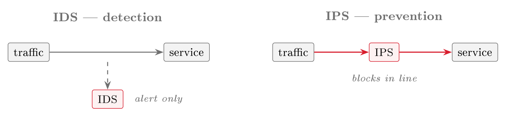

# Security monitoring and IDS {#sec-09-monitoring-ids}

Every control of Sessions 4 to 8 can fail: a firewall can be misconfigured,
an identity phished past its MFA, a WAF bypassed, a dependency flawed.
Prevention is therefore necessary but never sufficient, and monitoring
assumes that a breach will happen and arranges to discover it quickly. Its
foundation is the baseline of Session 2, because before something abnormal
can be recognised, normal must be known. This chapter covers what is
collected and how a large volume of it becomes a timely alert.

## Monitoring in the cloud {#sec-09-monitoring-cloud}

The CSA Security Guidance names four sources of complexity in cloud
monitoring (CSA, 2024, pp. 124–125). The first is the *management
plane*, which controls all administrative actions and must be watched
closely because it grants access to everything. The second is
*velocity*: changes occur at high speed, so automated responses are
needed to keep up. The third is *distribution and segregation*, which
limits the blast radius of a breach but requires some centralisation of logs
to see the whole estate. The fourth is *cloud sprawl* across workload
types and providers. Speed matters most: attacks on cloud systems are often
scripted, so data can be stolen or exposed within seconds or minutes of the
first break-in (CSA, 2024, p. 262), and detection of the most serious
activities therefore works in real time where possible, and in any case
within minutes. The shared-responsibility model applies here as elsewhere:
the provider monitors some layers and the customer others, and knowing which
is the starting point (CSA, 2024, p. 124).

## Events, alerts and telemetry {#sec-09-events-alerts-telemetry}

::: {#def-event}
## Event and alert
An **event** describes anything that happens in a system or network and
can be recorded (a login, an API call, a file access); most events are normal.
An **alert** describes a message that demands attention, produced by
analysing events, raised when events match a rule or pattern that signals a potential
threat. Alerts are not events: the task of monitoring is to turn a great many
events into a few meaningful alerts.
:::

::: {.callout-note title="Real world: Target, 2013"}
Around 40 million payment cards were stolen from the US retailer Target over
the holiday season. The attackers first entered through credentials taken
from a third-party heating and refrigeration contractor with network access,
then moved to the point-of-sale systems. Target's malware-detection system generated alerts about the intrusion, but
nobody acted on them in time. Detection is half the task: an alert nobody
responds to is no better than no alert. The response process of Session 12
exists for this reason.
:::

Alerts are fed by *telemetry*, the sources that show what is happening
in the environment (CSA, 2024, p. 127), and two sources matter most (CSA,
2024, p. 128). *Management plane logs* record control actions, that is,
who accessed the infrastructure, what they did and when, so an attacker on
the console leaves the first trace here. *Service and application logs*
record the activity of individual services: authentication attempts, API
access, network traffic, service-specific events. Nextcloud already produces
both kinds, namely the access log of Session 3 and the system journal of
Session 2, and monitoring means watching them continuously instead of
reading them afterwards.

## Detection: from telemetry to alert {#sec-09-detection}

Watching everything by hand does not scale, so detection narrows telemetry
to what deserves attention.

::: {#def-ids}
## Intrusion detection and prevention
An **intrusion detection system** (IDS) describes a system that monitors
telemetry for signs of attack and raises an alert. An **intrusion
prevention system** (IPS) describes a system that does the same but sits
*inline* in the traffic path, so that on a match it can block the traffic
rather than merely report it. Either may work by *signature* (matching
known attack patterns) or by *anomaly* (flagging departures from an
established baseline of normal behaviour). In the cloud these functions are
increasingly delivered as services, for example SIEM for correlating logs and
CSPM for detecting insecure configurations, rather than by a single
appliance.
:::

The distinction is the detect-versus-prevent choice of Session 4. An IDS is
the detection mode of the network: passive and out-of-band, it observes a
copy of the traffic and cannot stop an attack, so it cannot break legitimate
traffic, but it is only as fast as the humans who act on its alerts. An IPS
is the prevention mode: inline, it can drop a malicious packet in real time,
but a false positive then blocks a real user, and the device sits in the
critical path. Prevention stops more but risks more, so the two are used
together: an IPS blocks the clearly malicious, and an IDS surfaces the merely
suspicious for a human to judge.

{#fig-idsips fig-alt="Diagram — two side-by-side panels. Left ('IDS — detection'): traffic flows directly to the service while a dashed line taps a copy down to an IDS box labelled 'alert only'. Right ('IPS — prevention'): traffic passes through an IPS box sitting inline before reaching the service, labelled 'blocks in line'."}

The pattern the Guidance recommends is *cascade-and-filter*: a sequence
of detection mechanisms applied to the incoming streams, each narrowing the
data further (CSA, 2024, pp. 139–140). A first filter flags whatever looks broadly
suspicious, for example odd login attempts or unexpected network traffic;
later filters narrow toward known attack patterns; and a final
filter triggers an alert or a response action if a threat is confirmed. The
same cascade manages cost, because most raw logs stay cheaply where they
are and only pertinent alerts and selected logs go to the security team
(Session 10). To decide what to look for, the Guidance points to the MITRE
ATT&CK framework, a catalogue of the tactics and techniques attackers use,
which connects a given indicator with the stage of an attack it belongs to
(CSA, 2024, p. 127). It names key indicators to watch closely, namely
unusual IAM or network security activity, especially in unused regions (CSA,
2024, p. 127), and its list of detectors adds unauthorised API calls,
management console logins without MFA, any IAM policy change and any use of
the root account (CSA, 2024, p. 142). These are precisely the
management-plane and identity activities of Sessions 4 and 7. A further
technique cuts detection time sharply: a *canary* or *honey token*
is a decoy credential or resource that no legitimate process should touch,
so any interaction with it indicates an attempted or actual breach, with
almost no false positives (CSA, 2024, p. 142).

Comer (2021) adds two points on the mechanics. A monitor at its simplest is
a process that loops forever, checks each instance, raises an alert if one
fails to respond, and waits thirty seconds before repeating (Comer, 2021,
p. 182). That loop does not fit cloud-native systems, however (Comer, 2021,
p. 183). A traditional distributed application runs a known number of
instances in known places, so an instance that stops responding means
trouble. A cloud-native application, in contrast, starts and stops instances
all the time, and the orchestrator decides where each one runs, so a
monitoring tool must not raise an alarm every time an instance disappears
because the scale was reduced. This is the moving-target problem of Session 5 seen from
the monitoring side, and it is why cloud monitoring relies on
management-plane and orchestration signals rather than on a static list of
hosts.

The anomaly half of detection is *security analytics* (Comer, 2021,
pp. 239–240). Analytics software learns what normal behaviour looks like
and then watches for exceptions, for example an employee touching data or
services they never touch, or acting at an unusual hour; this is the
Session 2 baseline turned into a detector. Good analytics is context-aware,
because an access can be individually authorised and still suspicious when
it does not fit its usual pattern: the right person, the right permission,
the wrong context.

## Fast path and slow path {#sec-09-fast-slow-path}

Whether monitoring is timely depends on one further design choice, and it
follows from the speed problem above. The Guidance separates two processing
tracks (CSA, 2024, p. 135). The *slow path* carries logs, which can
arrive up to fifteen minutes after the fact, and that delay is acceptable
for investigation and forensics. The *fast path* carries events, which
are analysed and turned into alerts almost at once, and it is necessary for
high-risk activity, especially on the management plane, where fifteen
minutes is too long. Fast-path events therefore detect and alert on
high-risk activity as it happens, while slow-path logs serve the deeper
analysis that follows. A system that puts everything on the slow path
discovers its intrusions after they have finished.

::: {#exm-monitor-trc}
## Watching the red thread
*Threat*: an attacker who has passed the earlier controls, for example
with a phished credential, begins to act: logging in from an unrecognised
country, making unusual administrative changes, touching files no ordinary
user would. *Risk*: without monitoring the likelihood of noticing is low
and the impact grows with every undetected hour. *Controls*: alerts on authentication failures and impossible-travel
logins (fast path); the management plane and IAM changes watched as key
indicators; a canary file whose every access is a definite alarm; and the
access and system logs kept flowing for the timeline Session 12 requires. None of this
prevents the intrusion; it turns a silent compromise into a detected
incident.
:::

**Reading for this chapter.** CSA Security Guidance, Domain 6, in
particular §6.1 (Cloud Monitoring, pp. 124–127, including Logs & Events,
Alerts & Monitoring, Timeliness and Key Indicators), §6.2 (Cloud Telemetry
Sources, pp. 127–133), §6.3.3 (Monitoring Strategy, including the fast and
slow paths, pp. 135–137) and §6.4 (Detection & Security Analytics,
including the cascade-and-filter pattern, detectors, and canaries,
pp. 137–142); the domain runs pp. 124–145. Comer, Chapter 13,
§§13.3–13.4 (periodic monitoring and the added complexity of monitoring
cloud-native applications, pp. 182–183) and Chapter 17, §17.8 (security
analytics and context-aware anomaly detection, pp. 239–240); and the MITRE
ATT&CK® Cloud Matrix. Optional deepening:
Jøsang, Chapter 16 (Cyber Operations, pp. 337–354). The Microsoft Learn module is
*Describe Azure monitoring* (Microsoft Defender for Cloud and Sentinel).

## Summary {#sec-09-summary}

Because every preventive control can fail, monitoring assumes a breach and
detects it quickly, on the basis of the Session 2 baseline. Cloud
monitoring is shaped by two facts: attacks are fast and automated, and the
management plane is the highest-value target. Telemetry, that is,
management plane logs and service logs, is turned from many events into few
alerts (@def-event). Detection (@def-ids)
does this through signature and anomaly methods delivered by SIEM and CSPM,
arranged as a cascade-and-filter, guided by MITRE ATT&CK toward key
indicators (unauthorised API calls, IAM policy changes, network
configuration changes) and sharpened by canaries. Timeliness depends on
routing high-risk activity to the fast path and forensic logs to the slow
path. Nextcloud is now watched (@exm-monitor-trc), and Session 10
covers whether the record of what it saw can be trusted.

## Exercises {#sec-09-exercises}

::: {#exr-09-event-vs-alert}
## Event vs alert
Explain the difference between an event and an alert, and why "turning
events into alerts" is the central problem of monitoring.
:::

::: {#exr-09-telemetry-sources}
## The two key telemetry sources
Name the two most important cloud telemetry sources and state what each
records. Why does the Guidance insist that monitoring cover the management
plane?
:::

::: {#exr-09-signature-vs-anomaly}
## Signature vs anomaly detection
Distinguish signature-based from anomaly-based detection. Which one relies on
the Session 2 baseline, and why?
:::

::: {#exr-09-fast-vs-slow}
## Fast path vs slow path
What are the fast path and the slow path, and which should carry a suspicious
administrative action on the management plane, and why?
:::

::: {#exr-09-canary-token}
## The canary token
Explain how a canary (honey token) produces an alert with essentially no
false positives, and give one that could be placed in a Nextcloud deployment.
:::

## Self-check {#sec-09-self-check}

::: {.callout-note}
## Check your understanding in Canvas

These questions are also available as a self-marking quiz in Canvas:
**[Chapter 09 self-check quiz](CANVAS-QUIZ-URL-PLACEHOLDER)** *(link added
once the quiz is imported — see `canvas-export/README.md`)*.
:::

**Q1** *(tests @sec-09-monitoring-cloud · basic)*
Why does speed matter most among the complexities of cloud monitoring?

a. Because cloud providers delete telemetry after a few minutes, so it must be read at once
b. Because attacks on cloud systems are often scripted, so data can be stolen or exposed within seconds or minutes of the first break-in
c. Because the management plane throttles slow queries, making delayed analysis impossible
d. Because the shared-responsibility model requires the customer to report incidents to the provider in real time

**Q2** *(tests @sec-09-events-alerts-telemetry · basic)*
What does the Target 2013 case illustrate about monitoring?

a. Anomaly detection produces too many false positives to be useful in retail
b. Third-party contractors should never be given network access
c. Detection is half the task: an alert nobody responds to is no better than no alert
d. Point-of-sale systems cannot be monitored with management plane logs

**Q3** *(tests @sec-09-detection · basic)*
Which statement correctly distinguishes an IDS from an IPS?

a. An IDS sits inline and blocks malicious traffic; an IPS observes a copy and alerts
b. An IDS observes a copy of the traffic out-of-band and raises alerts; an IPS sits inline and can block traffic, at the risk of blocking a real user on a false positive
c. An IDS works only by signature; an IPS works only by anomaly
d. An IDS is a cloud service; an IPS is always a physical appliance

**Q4** *(tests @sec-09-detection · basic)*
In one or two sentences: what is the cascade-and-filter pattern, and which
two purposes does it serve?

**Q5** *(tests @sec-09-detection · basic)*
Name two of the key indicators or detectors the Guidance says to watch
closely on the management plane and identity systems.

**Q6** *(tests @sec-09-detection · basic)*
Why does the simple monitoring loop — poll every instance, alert if one
fails to respond — not fit cloud-native applications?

a. Cloud providers forbid polling because it consumes API quota
b. Cloud-native instances start and stop all the time under the orchestrator's control, so a disappearing instance is not by itself a sign of trouble
c. The loop is too fast: thirty seconds is shorter than the fast path requires
d. Cloud-native applications run a known number of instances in known places, so polling is redundant

**Q7 — applied scenario** *(tests @sec-09-exercises · applied)*
Building on @exr-09-canary-token: the Nextcloud team's analysts are drowning
in alerts, most of them false positives, and worry they would miss a real
intrusion. Propose a design that adds one canary to the deployment and
routes its alerts appropriately: say what the canary is, why any access to
it is almost certainly malicious, whether its alert belongs on the fast path
or the slow path and why, and name one other key indicator from this chapter
you would put on the same path. Justify each choice with a concept from this
chapter.
