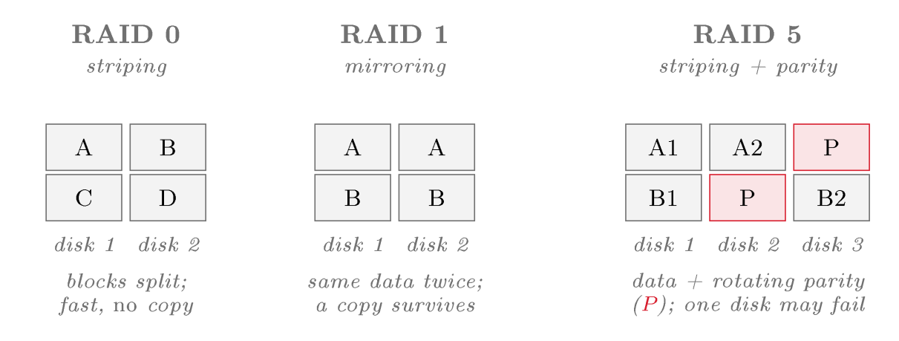

# Resilience, RAID and backup {#sec-11-resilience-raid-backup}

Most controls in this course reduce the *likelihood* of a bad event:
the firewall makes intrusion less likely, MFA makes account takeover less
likely, the WAF makes exploitation less likely. Resilience is different. It
accepts that a disk dies, a data centre floods, ransomware encrypts the
files or an administrator deletes the wrong directory, and it reduces the
*impact*, so that the service keeps running or recovers quickly. Two
tools carry it: redundancy, which lets a system survive a component
failure, and backup, which returns the system to a good state. Because the
two are constantly confused, keeping them apart is half the chapter.

## Availability revisited {#sec-11-availability-revisited}

Session 3 showed that chaining components multiplies their availabilities
down, so redundancy must be added on purpose, and Session 2 introduced the
geography, availability zones and region pairs, that makes large-scale
redundancy possible. The CSA Security Guidance describes resilience built on
that geography as layered (CSA, 2024, pp. 270–271). Single-region
resilience, with autoscaling, load balancing and backup, is where most
applications begin. Multi-region resilience, with parallel deployments
across regions, adds fault tolerance against regional outages at the cost
of duplicated resources and data synchronisation. The design goal at every
level is a small *blast radius*, so that one failure takes down as
little as possible. A deployment spread across availability zones survives
the loss of one. A service whose data is backed up survives the loss of its
storage. A system built from immutable images (Session 5) survives the loss
of an instance by replacing it.

## Redundancy and RAID {#sec-11-redundancy-raid}

The oldest form of redundancy works at the level of storage, and it is the
subject of this week's laboratory. In a data centre, storage is pulled out
of individual servers into centralised facilities (Session 2), and RAID is
part of how that storage survives the failure of the physical disks beneath
it.

::: {#def-raid}
## RAID
**RAID** (redundant array of independent disks) describes the
combination of several physical disks into one logical volume for
performance, redundancy, or both. **RAID 0** *stripes* data across
disks for speed but adds no redundancy, so one disk failing loses everything.
**RAID 1** *mirrors* data across disks, so a copy survives a disk
failure. **RAID 5** and **RAID 6** distribute data with
*parity*, tolerating one or two failed disks respectively while using
space more efficiently than mirroring.
:::

{#fig-raid fig-alt="Diagram — three side-by-side panels showing disk blocks under RAID 0 (blocks A–D split across two disks, 'blocks split; fast, no copy'), RAID 1 (blocks A and B duplicated on both disks, 'same data twice; a copy survives') and RAID 5 (data blocks plus rotating parity blocks P across three disks, 'data + rotating parity (P); one disk may fail')."}

RAID 0 is the trap in this list. Its name and its place among the redundant
arrays suggest safety, but it offers striping for speed with no redundancy
at all, so the array is more likely to lose data than a single disk,
because any one of several disks failing destroys the whole. It suits
scratch data one can afford to lose and nothing of value. A second rule
applies to all RAID levels and is the most frequently confused idea in this
area: *RAID is not a backup*. RAID protects against a disk failing, but
it does nothing against a file being deleted, corrupted or encrypted by
ransomware, because a mirror or parity array instantly and exactly copies
that deletion to every disk. Redundancy therefore keeps a service running
through hardware failure, and it cannot undo a mistake or an attack; that
requires a return to an earlier state, which RAID cannot provide.

## Backup {#sec-11-backup}

::: {#def-backup}
## Backup
A **backup** describes a separate, point-in-time copy of data, kept so
that the data can be restored after loss, corruption, deletion or attack.
Unlike redundancy, which maintains a current copy and therefore mirrors any
change including a harmful one, a backup preserves an *earlier* state to
which the system can return.
:::

Because a backup is a snapshot of the past, it survives exactly the events
RAID cannot: the accidental deletion, the corruption and above all the
ransomware that encrypts live data and mirror alike. A widely taught rule is
the *3–2–1 rule*: three copies of important data, on two different
kinds of media, with one copy off-site or, in the cloud, in a separate
account or region. The off-site copy matters for the same reason off-host
logs mattered in Session 10, because a backup an attacker can reach and
encrypt is no backup, so ransomware protection relies on copies that are
off-site and immutable. The Guidance adds the rule that addresses the most
common failure in practice: its preparation checklist requires backup
restoration testing at regular intervals and disaster-recovery tests at
least once per year (CSA, 2024, p. 255), because a backup that has never
been restored is not known to work.

::: {.callout-note title="Real world: Maersk and NotPetya, 2017"}
The NotPetya wiper spread through the shipping company Maersk in June 2017,
destroying tens of thousands of PCs and servers within minutes and halting
operations at ports worldwide. The damage was reported at roughly
\$300 million. The company could rebuild its network identity only because a single copy
of a critical directory server had survived: that machine, in an office in
Ghana, had been offline during a power cut while the malware spread. Two
facts follow. Redundancy that is always connected does not stop an attack
that propagates; an off-line, off-site copy saved the company, the off-site
element of the 3–2–1 rule. The company rebuilt because a good copy existed
and could be restored; a backup nobody can recover from is no backup.
:::

|                                                     | **RAID** | **Backup** |
|-----------------------------------------------------|:--------:|:----------:|
| Keeps the service running when a disk fails         | yes      | no         |
| Recovers a file deleted by mistake                  | no       | yes        |
| Recovers data corrupted or encrypted by ransomware  | no       | yes        |
| Allows a return to an *earlier* point in time       | no       | yes        |
| Protects against loss of the whole site             | no       | yes (if off-site) |

: RAID versus backup. They solve different problems and are used
together: RAID keeps the service running through a hardware failure, backup
recovers from everything else. {#tbl-raidbackup}

@tbl-raidbackup makes the division of labour explicit. Reading
down the backup column, almost everything that destroys data in practice,
the accidental deletion, the corrupting bug, the ransomware, the lost data
centre, is recovered by backup and none of it by RAID, because RAID copies
the damage. RAID buys *uptime* through hardware failure, whereas backup
buys *recoverability* from everything else. The two are therefore
complementary rather than alternatives, and having RAID is never an answer
to the question whether there are backups.

## Redundancy the provider builds in {#sec-11-provider-redundancy}

Redundancy runs deeper than the array built in the laboratory, because the
cloud's storage is engineered for it from the bottom. The network-attached
storage behind a data centre uses RAID so that the system continues to
operate when a disk fails, and a failed disk is replaced while the array
runs, known as *hot swapping* (Comer, 2021, pp. 103–104). Redundancy
also appears above the disks: in Hadoop's distributed file system each data
block is stored in redundant copies, typically three, spread across several
nodes, so that the failure of a machine loses no data and computation
continues on a surviving copy (Comer, 2021, pp. 156–157). The pattern is
the same at every level, more than one copy on more than one device, so that
any single failure is survivable, and cloud object storage expresses it as a
durability figure achieved by keeping several geographically separated
replicas of every object. Deletion, corruption and ransomware, however,
reach through all of that provider redundancy, because replicas copy the
damage as exactly as a RAID array does. Resilience is therefore layered: the
provider supplies durable storage, and the customer's own backup remains the
customer's responsibility.

## Designing for failure {#sec-11-designing-for-failure}

Taken together, the pieces make resilience a design stance rather than a
product. Redundancy, that is, RAID beneath the storage, instances spread
across availability zones and a service built to replace failed
components, keeps the system serving through the failures it can absorb.
Backup, off-site and tested, is the floor beneath everything, the way back
when redundancy is insufficient or the loss is not a hardware failure at
all. Disaster recovery planning, exercised yearly, ties the two together and
answers how, and how quickly, the organisation returns if the worst happens.
The immutable, use-and-replace pattern of Session 5 is thus a resilience
tool as much as a security one, and the snapshot of Session 2 was the first
backup.

::: {#exm-backup-trc}
## Backing up the red thread
*Threat*: the data is lost because a disk fails, a bug corrupts the
database, ransomware encrypts every file, or an administrator deletes the
wrong directory. *Risk*: for anything users rely on, the impact of
permanent loss is severe, and several of these causes are not rare.
*Controls*, correctly matched: RAID beneath the storage keeps the service
running through a single disk failure but is useless against the deletion,
corruption and ransomware, because it mirrors them. The decisive control
is therefore a regular backup of Nextcloud's data and configuration, kept
off-site (a separate account or region), held immutably against ransomware,
and restored on a schedule to prove that it works. The VM snapshot of
Session 2 serves as a rollback point but must not be mistaken for the backup,
and neither must the RAID. The threat is to availability and integrity; the
control that meets it is the tested restore.
:::

**Reading for this chapter.** CSA Security Guidance, Domain 11,
§11.6 (Resilience, pp. 270–273) and the incident-response checklist's
requirement for regular backup-restoration and disaster-recovery testing
(§11.1.1, p. 255); Comer, Chapter 8 (Virtual Storage; §8.7 NAS, RAID and
hot swapping, pp. 103–104) and §11.15 (block replication and fault
tolerance in HDFS, pp. 156–157). The Session 11 laboratory builds a RAID
array with `mdadm`; the choice of level is part of the exercise. The
Microsoft Learn module is *Describe Azure storage* (redundancy options
and Azure Backup).

## Summary {#sec-11-summary}

Resilience is impact reduction: it accepts that failures and disasters will
occur and ensures that the service survives or recovers, organised around a
small blast radius. Its two tools must be kept apart. Redundancy, that is,
RAID beneath storage (@def-raid), instances across
availability zones and replaceable immutable images, keeps a system running
through component failure, but RAID is not a backup, and RAID 0 is not even
redundant. Backup (@def-backup) is a point-in-time copy that
allows a return to an earlier state, so it survives the deletion, corruption
and ransomware that redundancy copies exactly; it follows the 3–2–1 rule,
off-site and immutable, and it is tested by restoring it, because an
untested backup is not a control. Together, exercised through
disaster-recovery testing, they form a design stance for failure. On the
red thread, Nextcloud's data is backed up off-site and the restore is
verified (@exm-backup-trc). Session 12 covers what to do when an
incident occurs.

## Exercises {#sec-11-exercises}

::: {#exr-11-resilience-vs-prevention}
## Resilience vs prevention
Explain how resilience differs from the preventive controls of earlier
sessions, in terms of likelihood versus impact.
:::

::: {#exr-11-raid0-trap}
## The RAID 0 trap
Why is RAID 0 a trap? Describe what it does and why it is less safe than a
single disk for data of value.
:::

::: {#exr-11-raid-not-backup}
## Why RAID is not a backup
State why RAID is not a backup. Give one failure RAID survives and two it does
not.
:::

::: {#exr-11-321-rule}
## The 3–2–1 rule
What is the 3–2–1 rule, and why does the off-site copy matter for
ransomware? Which control from Session 10 follows the same logic?
:::

::: {#exr-11-data-loss-trc}
## Data loss as threat–risk–control
Write, in the vocabulary of @def-trc, the threat, risk and
controls for the loss of the Nextcloud data, and identify the single control
that actually guarantees recovery.
:::

## Self-check {#sec-11-self-check}

**Q1** *(tests @sec-11-redundancy-raid · basic)*
Which of the following statements about RAID levels is correct?

a. RAID 0 mirrors data across disks, so a copy survives a disk failure
b. RAID 1 stripes data across disks for speed but adds no redundancy
c. RAID 5 distributes data with parity, tolerating one failed disk
d. RAID 6 combines several logical volumes into one physical disk

**Q2** *(tests @sec-11-redundancy-raid · basic)*
A colleague proposes storing the team's only copy of project data on a
RAID 5 array, arguing that the array's redundancy makes backups
unnecessary. Which option best explains why this is incorrect?

a. RAID 5 is less reliable than RAID 0, so a striped array should be used instead
b. RAID protects against a disk failing, but a deletion, corruption or ransomware encryption is copied instantly and exactly to every disk
c. RAID arrays cannot be rebuilt after any disk failure, so the data is already at risk
d. Parity data takes up so much space that there is no room left for a second copy

**Q3** *(tests @sec-11-backup · basic)*
According to the 3–2–1 rule, which of the following describes the required
copies of important data?

a. Three copies, on two different kinds of media, with one copy off-site
b. Three backups per day, kept for two weeks, restored once
c. Three disks in the array, two of them mirrored, one holding parity
d. Three regions, two availability zones, one provider

**Q4** *(tests @sec-11-availability-revisited · basic)*
In one or two sentences: what is meant by a small *blast radius*, and give
one example of a design choice from this chapter that reduces it.

**Q5** *(tests @sec-11-backup · basic)*
In one or two sentences: why does the CSA Guidance require backup
restoration testing at regular intervals?

**Q6** *(tests @sec-11-provider-redundancy · basic)*
Cloud object storage keeps several geographically separated replicas of
every object and advertises a high durability figure. Why does the
customer's own backup nevertheless remain the customer's responsibility?

a. Provider replicas are stored on RAID 0 arrays and can be lost at any time
b. Durability figures only apply to data centres in the customer's own region
c. The provider deletes replicas after a fixed retention period
d. Deletion, corruption and ransomware reach through provider redundancy, because replicas copy the damage exactly

**Q7 — applied scenario** *(tests @sec-11-designing-for-failure · applied)*
Building on @exr-11-data-loss-trc: your team runs Nextcloud with RAID 5
beneath the storage and keeps the Session 2 VM snapshot on the same cloud
account. One morning, ransomware has encrypted the live data. For each of
the three safeguards in place (RAID, snapshot, and any backup regime you
would add), state whether it helps in this event and why, and then describe
the backup regime this chapter says would have guaranteed recovery,
justifying each property (location, immutability, testing) with a concept
from the chapter.
