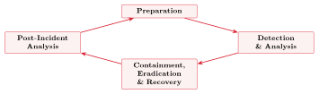
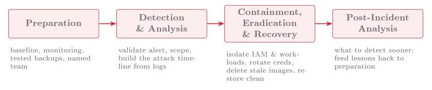

# Incident response, BCM, risk and compliance {#sec-12-incident-response-bcm}

Two topics remain. The first is what to do when prevention fails and an
attack succeeds: incident response, the organised handling of the breach
that the whole course has been arranged to make less likely and, since
Session 9, to detect. The second is the frame above every individual
control, namely risk, audit and compliance, the level at which an
organisation answers for its security to its management, to regulators and
to the people whose data it holds.

## Events, incidents and breaches {#sec-12-events-incidents-breaches}

Response begins with classification, because not everything that happens is
an emergency. Session 9 separated events from alerts, and the CSA Security
Guidance extends this into a three-level scale (CSA, 2024, p. 254).

::: {#def-incident}
## Event, incident, breach
An **event** describes any observable occurrence, most of them benign.
An **incident** describes an event that violates security policy or
threatens the confidentiality, integrity or availability of a system and
demands a response. A **breach** describes a successful penetration or
circumvention of controls leading to unauthorised access to, or extraction
of, data. All incidents are events; not all events are incidents; and only
some incidents become breaches.
:::

The scale sets the response: an event is logged, an incident is handled, and
a breach may trigger legal and regulatory obligations to notify. Getting the
classification right, neither escalating every anomaly nor dismissing a real
intrusion as noise, is the first judgement of response, and it depends on
the monitoring and trustworthy logs of Sessions 9 and 10.

## The incident response lifecycle {#sec-12-ir-lifecycle}

For handling incidents the Guidance adopts the lifecycle of NIST
SP 800-61 (CSA, 2024, p. 254).

::: {#def-irlifecycle}
## Incident response lifecycle
The **incident response lifecycle** (NIST SP 800-61) describes four
phases: *Preparation* (build the team, plans, tools and baselines before
anything happens); *Detection & Analysis* (identify the incident and
understand its scope); *Containment, Eradication & Recovery* (stop the
damage, remove the attacker, restore service); and *Post-Incident
Analysis* (learn, and feed the lessons back into preparation). It is a cycle:
each incident improves readiness for the next.
:::

The Guidance's checklist gives each phase its cloud-specific content, and
almost every item draws on a control from an earlier session (CSA, 2024,
pp. 255–256). *Preparation* covers a team with assigned roles, a
communication plan, and responder access to environments and tools. It also
covers internal documentation including a network traffic baseline
(Session 2), proactive scanning and monitoring (Session 9), audit logs,
snapshots and forensics capabilities (Sessions 2 and 10), and regular backup
restoration testing with disaster-recovery tests at least once per year
(Session 11). *Detection & Analysis* uses alerts from CSPM, SIEM,
workload protection and network monitoring, validates them to reduce false
positives, estimates the scope and assigns an incident manager; it then
builds a timeline of the attack from the logs, which is why log integrity
mattered. *Containment, Eradication & Recovery* is where the cloud
differs most. Containment treats IAM and the management plane as the top
priorities, isolating identities and workloads, taking systems offline, and
weighing data loss against availability (CSA, 2024, pp. 267–268). Because
federated identity separates authentication from authorisation, a blocked
user may still hold a valid session token, so containment may require
actions on both the identity provider and the relying party. Eradication
then removes the attacker from the management plane permanently through
credential rotation, additional policy conditions and MFA (Session 7) (CSA,
2024, pp. 268–269). In the cloud, replacing a resource is usually simpler
than expelling an attacker from it, so ephemeral resources are wiped and
replaced rather than fixed. Old images, old function code and old
infrastructure definitions are deleted as well, because a careless
redeployment of any of them could let the attacker back in. Recovery
deploys hardened versions from IaC and automation, after analysing all
images, resources and templates for remaining backdoors (CSA, 2024,
p. 269). This form of eradication is easier for cloud-native applications
and harder under lift-and-shift (Session 5). Throughout, incident data is
captured under chain of custody (Session 10). Lastly, *Post-Incident
Analysis* asks what should have gone better, that is, whether the attack
could have been noticed earlier, which data was missing when it was needed,
and whether the process itself has to change (CSA, 2024, pp. 255,
269–270), and the answers go back into preparation.

{#fig-irloop fig-alt="Diagram — four boxes arranged in a circle (Preparation, Detection & Analysis, Containment/Eradication & Recovery, Post-Incident Analysis) with arrows leading from each to the next and from Post-Incident Analysis back to Preparation, forming a loop."}

{#fig-irphases fig-alt="Diagram — the four lifecycle phases in a left-to-right row, each with its cloud-specific actions listed beneath: Preparation (baseline, monitoring, tested backups, named team); Detection & Analysis (validate alert, scope, build the attack timeline from logs); Containment, Eradication & Recovery (isolate IAM & workloads, rotate creds, delete stale images, restore clean); Post-Incident Analysis (what to detect sooner; feed lessons back to preparation)."}

::: {#exm-ir-trc}
## An incident on the red thread
The monitoring of Session 9 raises an alert: a canary file in Nextcloud was
accessed, and the management plane shows an unfamiliar administrative action.
*Preparation* has already provided the alert, the off-host logs and a
tested backup. *Detection & Analysis*: the alert is validated, the
off-host logs are pulled, and a timeline is built: a phished administrator
credential (Session 7), used from an unusual location. *Containment*: the
account is disabled, its sessions revoked, the affected workload isolated.
*Eradication & Recovery*: all credentials are rotated, MFA enforced, any
images or configuration the attacker may have altered deleted, and Nextcloud
restored from the clean backup of Session 11, whose restore was tested.
*Post-Incident Analysis*: MFA was not enforced on every administrative
path; this goes back into preparation. Every phase uses a control an earlier
session built.
:::

## Resilience and business continuity {#sec-12-business-continuity}

Incident response overlaps with a broader question the Guidance places
alongside it: how the organisation keeps operating through disruption at
all. The Guidance expects responders to work together with the people who
keep the business running, and it reminds management, the legal department
and the compliance function that a cloud incident gives each of them a part
to play (CSA, 2024, pp. 257–258). *Business continuity management*
(BCM) is this field. Where the resilience of Session 11 protects the
technical service, continuity protects the business function the service
supports, and two targets quantify it. The *recovery time objective*
(RTO) states how quickly a service must be back, and the *recovery
point objective* (RPO) states how much recent data the organisation can
afford to lose; together they set how often backups are taken and how fast
a restore must be. Continuity planning also means training staff so that
they can fall back to a spare system, or to paper, while the main system is
down, so that a technical failure does not become an operational collapse.
Resilience, backup, disaster recovery and continuity thus form one line:
keep the service up if possible, recover it fast if not, and keep the
business running either way.

## Risk, audit and compliance {#sec-12-risk-audit-compliance}

The final step is the governance layer, because a security programme is not
a set of controls but a managed response to *risk*, judged against
obligations on which the organisation can be *audited*. The CSA
Security Guidance treats this in Domain 3.

::: {#def-riskregister}
## Risk register
A **risk register** describes a repository of identified risks, their
severity, and the actions taken to manage each. It makes risk management
systematic, allowing an organisation to prioritise its effort and to align
mitigation with its declared *risk appetite* rather than reacting case by case
(CSA, 2024, pp. 66, 78–79).
:::

The register is the core of *governance, risk and compliance* (GRC),
and the Guidance names further non-technical tools around it (CSA, 2024,
pp. 78–79). The shared-responsibility model is applied by the customer to
each service. *Contracts* fix the legal division of responsibility and
thereby make the Session 1 model binding. A *cloud register* lists the
providers and deployments the organisation depends on (CSA, 2024,
pp. 66–67). Monitoring and audit frameworks provide continuous assurance
that controls work (CSA, 2024, pp. 75–77). One idea is specific to the
cloud, *compliance inheritance*: a customer using a compliant
provider's infrastructure inherits that control set for the infrastructure
layer, but the compliance of whatever the customer builds on top remains
the customer's own task (CSA, 2024, p. 73), which is the
shared-responsibility model in the language of audit. Automation serves
governance too, because cloud infrastructure is defined in code, so its
configuration is a document that can be reviewed, versioned and proven; the
practice that shifted security left in Session 8 therefore also supports
compliance (CSA, 2024, pp. 80–81).

For a Norwegian institution the regulatory frame is European. The CSA text
is US-centred, though it lists DORA among its examples (CSA, 2024, p. 71),
so the course situates its GRC content where its students will work. The EU
*NIS2* directive raises cybersecurity and incident-reporting
obligations across essential and important sectors; *DORA* imposes
operational-resilience and third-party-risk requirements on the financial
sector; and *ISO 22301* is the international standard for business
continuity management. Students are not expected to master these
instruments, only to recognise that the technical work of the previous
eleven sessions exists inside a legal and regulatory frame, in which a risk
register, an audit trail, an incident-notification plan and a tested
continuity capability are the form security takes when an organisation must
answer for it.

Two observations from Comer (2021) mark the edges of what any control set
can reach. First, some cloud risks are structural (Comer, 2021, p. 242).
*Side channels* leak information between tenants sharing physical
hardware through indirect signals rather than any explicit access, and
*back doors* are hidden means of access left in software or hardware.
Neither is stopped by a firewall or a password, so these are exactly the
risks a register exists to record and to accept knowingly. Secondly, the
provider is not only a source of risk but a partner in managing it (Comer,
2021, pp. 242–243). Traditional IT kept outsiders out on principle,
whereas a cloud tenant depends on the provider, sets its own security policy
and relies on the provider to help carry it out. A tenant with several
providers has to make sure that the same policy holds on each of them. This
is compliance inheritance seen from the other side. Governance therefore
covers not only the controls an organisation operates itself but also the
choice, assessment and contracting of the provider whose controls it
inherits, together with a clear view of the residual risks that remain its
own.

**Reading for this chapter.** CSA Security Guidance, Domain 11,
§11.1 (Incident Response and the lifecycle checklist, pp. 254–256), §11.2
(Preparation, pp. 256–261), §11.3 (Detection & Analysis, pp. 261–267),
§11.4 (Containment, Eradication & Recovery, pp. 267–269) and §11.5
(Post-Incident Analysis, pp. 269–270); Domain 3, §3.1 (Cloud Risk
Management, including the cloud register, pp. 56–68), §3.2 (Compliance &
Audit, including compliance inheritance, pp. 68–78) and §3.3 (GRC Tools &
Technologies, pp. 78–81). Comer, Chapter 17, §§17.11–17.12 (back doors,
side channels and other concerns, and cloud providers as partners,
pp. 242–243). The Microsoft Learn module is *Describe Azure governance*
(Azure Policy, Microsoft Purview compliance).

## Summary {#sec-12-summary}

When prevention fails, response takes over, beginning with the
classification of events, incidents and breaches
(@def-incident) that sets the level of reaction. The
incident response lifecycle (@def-irlifecycle), with the
phases Preparation, Detection & Analysis, Containment/Eradication/Recovery
and Post-Incident Analysis, gathers the course into one procedure, because
the baseline, monitoring, snapshots, off-host logs, MFA and tested backups
of earlier sessions are exactly what each phase uses. The cloud-specific
priorities are containing the management plane, rotating credentials,
deleting stale images and recovering from clean definitions
(@exm-ir-trc). Above the incident sits business continuity, with
RTO and RPO, spare systems and trained staff, which keeps the business
function alive through disruption. Above the technical layer sits
governance, risk and compliance: the risk register
(@def-riskregister) and the GRC tools around it, compliance
inheritance from the provider, the auditability of infrastructure as code,
and the regulatory frame (NIS2, DORA, ISO 22301) within which a Norwegian
organisation operates. Session 13 assembles the layers into one argument.

## Exercises {#sec-12-exercises}

::: {#exr-12-event-incident-breach}
## Event, incident, breach
Distinguish an event, an incident and a breach, and state which may trigger
legal notification obligations.
:::

::: {#exr-12-four-phases}
## The four incident-response phases
Name the four phases of the incident response lifecycle and, for each, one
control from an earlier session that it relies on.
:::

::: {#exr-12-rebuild-vs-patch}
## Why rebuild rather than patch
In cloud containment and eradication, why rotate credentials and delete old
images and IaC rather than simply patching the running system?
:::

::: {#exr-12-rto-rpo}
## RTO and RPO
What do RTO and RPO measure, and how do they determine how often backups are
taken and how fast a restore must be?
:::

::: {#exr-12-register-inheritance}
## Risk register and compliance inheritance
What is a risk register, and what is compliance inheritance? Relate the
latter to the shared-responsibility model of Session 1.
:::

::: {#exr-12-ir-lifecycle}
## The incident response lifecycle, interactive
The six actions below come from the lifecycle of @def-irlifecycle as
@sec-12-ir-lifecycle describes it for the cloud. Arrange them into the
order in which the lifecycle performs them: drag a step to its place, or
use the arrow buttons to move it up and down, then press **Check**.


:::

::: {#exr-12-event-incident-breach}
## Event, incident or breach?, interactive
@def-incident gives response its three-level scale. Sort each occurrence
below into the right level: drag it onto a box, or click the occurrence and
then the box, then press **Check**. Click a placed item to send it back to
the pool.


:::

## Self-check {#sec-12-self-check}

**Q1** *(tests @sec-12-events-incidents-breaches · basic)*
Which of the following statements about events, incidents and breaches is
correct?

a. All events are incidents, but only some incidents are events
b. All incidents are events, but not all events are incidents, and only some incidents become breaches
c. An event and an incident are the same thing viewed at different times
d. A breach is any observable occurrence, most of them benign

**Q2** *(tests @sec-12-ir-lifecycle · basic)*
Which option lists the four phases of the NIST SP 800-61 incident response
lifecycle in the correct order?

a. Detection & Analysis; Preparation; Post-Incident Analysis; Containment, Eradication & Recovery
b. Preparation; Containment, Eradication & Recovery; Detection & Analysis; Post-Incident Analysis
c. Preparation; Detection & Analysis; Containment, Eradication & Recovery; Post-Incident Analysis
d. Identification; Protection; Detection; Recovery

**Q3** *(tests @sec-12-ir-lifecycle · basic)*
In one or two sentences: during containment, why may blocking a user at the
identity provider not be enough, and what else may be required?

**Q4** *(tests @sec-12-business-continuity · basic)*
An organisation states that it can afford to lose at most one hour of
recent data for its ordering system. Which target has it set?

a. The recovery time objective (RTO)
b. The recovery point objective (RPO)
c. The risk appetite
d. The blast radius

**Q5** *(tests @sec-12-risk-audit-compliance · basic)*
In one or two sentences: what is compliance inheritance, and which part of
the compliance task remains the customer's own?

**Q6** *(tests @sec-12-risk-audit-compliance · basic)*
According to Comer, why do side channels and back doors belong in the risk
register?

a. They are stopped by a correctly configured firewall, so the register records the firewall rule
b. They are structural risks that no firewall or password stops, so the register exists to record and accept them knowingly
c. They only occur in on-premises data centres, so cloud tenants can ignore them
d. They are examples of compliance inheritance from the provider

**Q7 — applied scenario** *(tests @sec-12-ir-lifecycle · applied)*
Building on @exr-12-rebuild-vs-patch: the timeline for the Nextcloud
incident of @exm-ir-trc shows that the attacker held an administrator
credential for two days and pushed at least one change to a container image.
A colleague proposes to patch the running container, re-enable the admin
account with a new password, and close the incident. Walk through
Containment, Eradication & Recovery as this chapter describes them for the
cloud, explain what the colleague's plan misses, and name the control from
an earlier session that each of your steps relies on.
