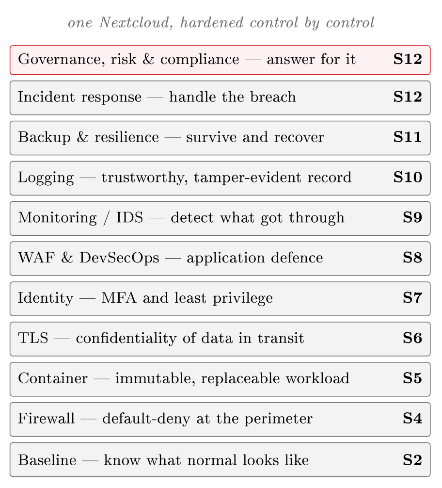

# The integrated case {#sec-13-integrated-case}

This chapter introduces no new material. It gathers the controls of
Sessions 2 to 12 into one picture, maps them onto the NIST Cybersecurity
Framework 2.0, and makes the argument, layer by layer, that the hardened
service is defensible.

## The hardened stack {#sec-13-hardened-stack}

Each session added one layer to the same service, and each layer answered a
threat with a control and a reason. Session 2 set up a virtual machine
running Linux and recorded its *baseline*, the picture of normal that
every later detection measures against. Session 3 put the service under
load and covered denial of service. Session 4 closed the ports with a
*firewall* under default-deny. Session 5 deployed Nextcloud as a
*container*, choosing the cloud-native, immutable pattern. Session 6
wrapped the transport in *TLS*, and Session 7 hardened *identity*
with MFA and least privilege. Session 8 shielded the application with a
*WAF* and built security into the pipeline with DevSecOps. Session 9
turned the baseline into continuous *monitoring*, and Session 10
protected the *logs* off-host and tamper-evident, so that a compromise
cannot erase its own trace. Session 11 made the data survivable with
*backup* and redundancy, tested by restoring, and Session 12 prepared
the *response* to the incident that gets through, inside a frame of
risk, audit and compliance.

These layers are independent by design, and that is what makes them one
system rather than a list. The firewall catches what the WAF would not, the
WAF catches what secure coding missed, MFA catches the stolen password,
monitoring catches what all of them let through, and backups recover what
nothing prevented. Defence in depth (Session 4) is therefore not a slogan
here but the structure of what was built.

{#fig-stack fig-alt="Diagram — a vertical stack of eleven labelled layers, bottom to top: Baseline — know what normal looks like (S2); Firewall — default-deny at the perimeter (S4); Container — immutable, replaceable workload (S5); TLS — confidentiality of data in transit (S6); Identity — MFA and least privilege (S7); WAF & DevSecOps — application defence (S8); Monitoring / IDS — detect what got through (S9); Logging — trustworthy, tamper-evident record (S10); Backup & resilience — survive and recover (S11); Incident response — handle the breach (S12); Governance, risk & compliance — answer for it (S12); captioned 'one Nextcloud, hardened control by control'."}

## Mapping to the NIST Cybersecurity Framework {#sec-13-csf-mapping}

To show that the picture is complete rather than merely long, it is mapped
onto a recognised framework. The NIST Cybersecurity Framework 2.0 (2024)
has three levels. At the top are six *Functions*: Govern, Identify,
Protect, Detect, Respond and Recover. Each Function divides into
*Categories*, groups of related outcomes; Protect, for example, has one
Category for identity and access control, another for data security and
another for platform security. Each Category divides again into
*Subcategories*, the specific, testable outcomes an organisation
achieves. In total CSF 2.0 defines 22 Categories and 106 Subcategories.
Govern is drawn at the centre, because it sets the strategy and policy on
which the other five depend, and whereas Govern, Identify, Protect and
Detect run continuously, Respond and Recover stand ready for the incident.

The Categories are where completeness is tested. Claiming to protect a
service is easy, whereas the Categories ask whether identity, data, the
platform and infrastructure resilience are each protected.
@tbl-csf therefore places each Function's Categories beside the
sessions that populate them.

| **Function** | **Categories (CSF 2.0)** | **Where this course populates it** |
|--------------|--------------------------|------------------------------------|
| **Govern** (GV) | Organizational Context; Risk Management Strategy; Roles, Responsibilities & Authorities; Policy; Oversight; Cybersecurity Supply Chain Risk Management | Risk register, shared-responsibility model, the NIS2/DORA/ISO 22301 frame, and supply-chain risk via the SBOM (S12, S8) |
| **Identify** (ID) | Asset Management; Risk Assessment; Improvement | Data classification (S6); asset and dependency inventory / SBOM (S8); risk assessment and the register (S12) |
| **Protect** (PR) | Identity Management, Authentication & Access Control; Awareness & Training; Data Security; Platform Security; Technology Infrastructure Resilience | IAM, MFA and least privilege (S7); TLS and data protection (S6); the firewall and segmentation (S4); WAF and secure development (S8); platform hardening: baseline, containers, patching (S2, S5); backup and resilience (S11) |
| **Detect** (DE) | Continuous Monitoring; Adverse Event Analysis | Monitoring, IDS/IPS and telemetry (S9); trustworthy, tamper-evident logs (S10) |
| **Respond** (RS) | Incident Management; Incident Analysis; Incident Response Reporting & Communication; Incident Mitigation | The incident response lifecycle: containment, eradication, analysis and reporting (S12) |
| **Recover** (RC) | Incident Recovery Plan Execution; Incident Recovery Communication | Tested backup restoration, disaster recovery and business continuity (S11, S12) |

: The course mapped onto the six CSF 2.0 Functions and their
Categories. Every Function is populated, and so is every Category: identity,
data, platform and infrastructure resilience each have a home under Protect,
rather than Protect being a single undivided claim. {#tbl-csf}

Reading down the table is the test of the word defensible. It does not mean
that the service cannot be attacked; it means that the protection is
complete across the framework at the level of Categories, and that for each
Category the control, the threat it meets and the reason it belongs can be
named. An empty Category is a real gap, because a service with no entry
under Detect is blind and one with nothing under Recover cannot come back.
A mature programme works down to the Subcategories; for this course, a
control in every Category, defended in the threat–risk–control vocabulary
of Session 1, is the standard.

## The argument {#sec-13-argument}

The course ends where it began. Behind the metaphor of the cloud stand
machines, networks, identities and data, each with a threat, each met by a
control chosen because the threat was understood. Security is therefore a
method rather than a product: name the threat, judge the risk, choose the
control that fits, state why, and add the next layer, because no single
control is sufficient. The method has been applied eleven times to one
service, and it transfers to any other.

One further observation explains why the task is never simply finished.
Comer (2021) closes his book with the complexity of cloud-native systems
(Comer, 2021, pp. 247–249). A cloud-native application is a large
*distributed* system, and such systems are complex by nature, however
carefully they are built: copies of the same data drift apart, the number
of instances can explode under load, network delays have effects nobody
planned for, and processes can end up waiting for each other forever.
Security lives inside that complexity. This is why the defensible system is
a set of independent layers rather than a single mechanism, and why
monitoring assumes that prevention will fail. It is also why the question
whether a system is secure never has a permanent yes as its answer, only a
position that must be argued again as the system changes.

**Reading for this chapter.** No new domains. Students revisit the
domains and chapters behind each layer as they assemble their case; Comer,
Chapter 18 (Controlling the Complexity of Cloud-Native Systems, pp. 247–249),
is the intellectual close. The NIST Cybersecurity Framework 2.0 (2024) is the
mapping framework; its six Functions and their Categories should be known by
name.

## Summary {#sec-13-summary}

One Nextcloud has been hardened across thirteen sessions into a single
defensible system whose layers (baseline, firewall, container, TLS,
identity, WAF, monitoring, logging, backup, response, governance) are
independent by design, so that each catches what the others miss. Mapped
onto the six Functions of the NIST Cybersecurity Framework 2.0 and their
Categories, the protection is complete rather than merely long, which is
what defensible means here. The method is the same at every layer: name the
threat, judge the risk, choose the control that fits, state why, and add the
next layer. The cloud remains somebody else's computer; what the course adds
is the ability to argue, layer by layer, why the service running on it is
defensible.

## Closing exercise {#sec-13-closing-exercise}

Take the group's own hardened service and, for each of the six NIST CSF 2.0
Functions (Govern, Identify, Protect, Detect, Respond, Recover), name one
control implemented, the threat it meets, and one sentence on why it belongs
there. Better still, go one level finer and place each control under a
*Category* of @tbl-csf. If every Function has at least one
entry and each can be defended in the threat–risk–control vocabulary of
Chapter 1, the defence is complete across the framework. Where a Function or a
Category is thin, that is a gap in the defence rather than in the exercise,
and finding it now is the purpose of the exercise.

::: {#exr-13-csf-functions}
## Populating the six Functions, interactive
@tbl-csf places the course's controls under the six Functions of the NIST
CSF 2.0. Sort each control below under its Function: drag it onto a box, or
click the control and then the box, then press **Check**. Click a placed
control to send it back to the pool.


:::

::: {#exr-13-stack-layers}
## The hardened stack, interactive
Six boxes below describe the role a layer of @fig-stack plays in the
hardened service of @sec-13-hardened-stack. Drag the matching layer onto
each role (or click a layer, then click a box), then press **Check**. Two
of the eight layers offered belong to none of the boxes shown.


:::

::: {#exr-13-csf-numbers}
## CSF 2.0 by the numbers, interactive
@sec-13-csf-mapping describes the three levels of the NIST Cybersecurity
Framework 2.0. Fill in how many of each the framework defines and press
**Check** — each line turns green or red on its own.


:::

::: {#exr-13-argument-tf}
## The closing argument: true or false?, interactive
@sec-13-argument closes the course with what security is, and with Comer's
warning about the complexity of cloud-native systems. Mark each statement
below **True** or **False**, then press **Check**.


:::

::: {#exr-13-method-order}
## The method, interactive
@sec-13-argument states the method the course has applied eleven times to
one service. Arrange its five steps into the right order: drag a step to
its place, or use the arrow buttons to move it up and down, then press
**Check**.


:::

## Self-check {#sec-13-self-check}

**Q1** *(tests @sec-13-csf-mapping · basic)*
Which option names the six Functions of the NIST Cybersecurity
Framework 2.0?

a. Prepare, Detect, Analyse, Contain, Eradicate, Recover
b. Govern, Identify, Protect, Detect, Respond, Recover
c. Baseline, Firewall, Identity, Monitoring, Logging, Backup
d. Confidentiality, Integrity, Availability, Risk, Audit, Compliance

**Q2** *(tests @sec-13-csf-mapping · basic)*
Why is the Govern Function drawn at the centre of CSF 2.0?

a. It sets the strategy and policy on which the other five Functions depend
b. It contains the most Subcategories of any Function
c. It is the only Function that stands ready for the incident rather than running continuously
d. It replaces the Identify Function in version 2.0

**Q3** *(tests @sec-13-hardened-stack · basic)*
According to this chapter, what makes the course's layers one system rather
than a list?

a. Every layer is configured from the same management console
b. Each layer depends on the layer beneath it working correctly
c. The layers are independent, so each catches what the others miss
d. All the layers were installed in a single session

**Q4** *(tests @sec-13-csf-mapping · basic)*
In one or two sentences: what does *defensible* mean in this chapter? Make
clear what it does *not* mean.

**Q5** *(tests @sec-13-argument · basic)*
In one or two sentences: why, according to this chapter, does the question
whether a system is secure never have a permanent yes as its answer?

**Q6** *(tests @sec-13-csf-mapping · basic)*
A team's CSF mapping has entries under every Function except Detect. What
does the chapter say this means?

a. Nothing serious, because Detect is optional when Protect is complete
b. The service is blind: an empty Category is a real gap in the defence
c. The gap is in the mapping exercise, not in the defence
d. The team should merge Detect into Respond, since both stand ready for the incident

**Q7 — applied scenario** *(tests @sec-13-closing-exercise · applied)*
Building on the closing exercise in @sec-13-closing-exercise: your group's
mapping shows three controls under Protect but nothing under Govern and
nothing under Recover, and a groupmate argues the service is nevertheless
defensible because "Protect is where the real security happens". Using this
chapter's account of the six Functions and the test of completeness at the
level of Categories, explain what is wrong with that argument, state what
the two empty Functions mean concretely for the service, and name one
control from the course that would populate each of them, defending each in
the threat–risk–control vocabulary.
